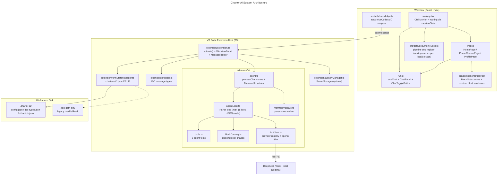
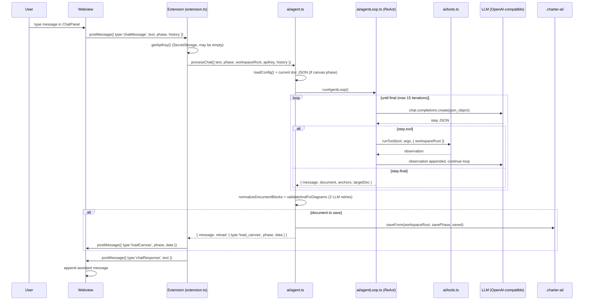
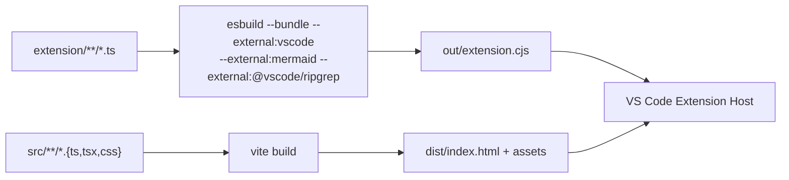

# Charter Ai Architecture

Charter Ai is a VS Code extension with a dynamic document pipeline: Home starts empty, and
documents (BlockNote canvases) are created via the **New Document** dialog, the Ask bar, or
the agent's `generate_pipeline` tool. It is built in two layers:

1. **Webview (React + Vite)** — the UI: Home, canvas pages, chat panel, profile.
2. **TS extension host** — everything non-UI: `.charter-ai/` persistence, the ReAct agent
   loop, LLM calls, and the agent's codebase/pipeline tools.

The webview talks to the extension host via `postMessage`. The extension host runs entirely
on Node (the extension host's own runtime) — there is no separate backend process to spawn
or bundle. All AI work uses an OpenAI-compatible provider (DeepSeek by default, Kimi/local
optional) — not Copilot.

## Data Flow (AI chat + canvas draft)

Interim status (e.g. "Thinking…") is pushed via `chatStatus` messages. If `generate_pipeline`
changed the pipeline, a `loadDocTypes` message (with `mode: 'merge' | 'replace'`) refreshes
the Home grid. The webview times out unanswered chats after 180 s.

## Message protocol

Defined in `extension/protocol.ts`. The extension host calls plain TS functions directly —
there is no cross-process protocol or serialization layer beyond these types.

| Webview → Extension | Purpose |
|---------------------|---------|
| `loadDocTypes` / `saveDocTypes` | Read / write `doc-types.json` (pipeline registry) |
| `loadCanvas` / `saveCanvas` | Read / write a document canvas (`<phase>.json`) |
| `loadWorkspaceInfo` | Ensure `.charter-ai/` exists; reply with `workspaceInfo` |
| `chatMessage` | Full AI flow: ReAct loop → tools → LLM → save canvas |
| `navigate` / `ready` | View routing / handshake |

| Extension → Webview | Purpose |
|---------------------|---------|
| `loadDocTypes` (`mode?`) | Pipeline registry snapshot (merge on startup, replace after rebuild) |
| `loadCanvas` | Saved/updated document canvas |
| `chatResponse` / `chatStatus` | Chat reply text / interim status |
| `workspaceInfo` | Open folder path + name (used to scope webview localStorage) |
| `navigateTo` | View navigation request |

## Persistence

- **Disk (source of truth):** `.charter-ai/` — `config.json`, `doc-types.json`, and one
  `<doc-id>.json` per pipeline document. Reads fall back to the legacy `.req-gath-sys/`
  directory from pre-rebrand installs.
- **Webview localStorage:** workspace-scoped cache (FNV-1a key per folder path) for doc
  types, drafts, and tutorial flags — never crosses projects.

## LLM providers

Configured in `extension/ai/llmClient.ts` (`PROVIDERS` registry). All are OpenAI-compatible.

| Provider | base_url | Default model | API key env |
|----------|----------|---------------|-------------|
| `deepseek` (default) | `https://api.deepseek.com` | `deepseek-v4-flash` | `DEEPSEEK_API_KEY` |
| `kimi` | `https://api.moonshot.ai/v1` | `kimi-k2.6` | `MOONSHOT_API_KEY` |
| `local` | `http://localhost:11434/v1` | `llama3.2` | (none) |

- Active provider/model: `.charter-ai/config.json` → `{ "llm": { "provider": "deepseek", "model": null } }`.
- API key resolution order: SecretStorage (passed by the extension) → provider env var →
  generic `REQ_GATH_SYS_API_KEY` / `LLM_API_KEY`.
- Calls use JSON mode (`response_format: json_object`), a 180 s timeout, up to 2 retries
  on transient failures, and disable thinking for DeepSeek/Kimi (reasoning can consume the
  whole token budget).

## Agent tools

Implemented in `extension/ai/tools.ts` (`TOOL_NAMES`, `TOOL_CATALOG`, `runTool`):

| Tool | Purpose | Caps |
|------|---------|------|
| `list_dir` | Folder tree orientation, flags relevant dirs | depth ≤ 2, 40 children |
| `glob` | Files by pattern or preset (`config` / `entry points` / `tests`) | 50 results |
| `grep` | Ripgrep regex over contents, ranked, ±1 line context | 50 matches/pattern, 12 KB observation |
| `read_file` | Read a known file with line range | 2000 lines |
| `validate_mermaid` | Parse-check Mermaid → ready diagram block | 8000 chars |
| `list_pipeline` | List pipeline docs | — |
| `generate_pipeline` | Create slots (`append` / `replace`) | 12 docs max |
| `remove_pipeline_docs` | Remove slots (ids/names/`all`) | — |

## Build Pipeline

| Command | What it does |
|---------|--------------|
| `npm run build` | Build extension bundle + webview |
| `npm run build:extension` | esbuild → `out/extension.cjs` (bundles `openai`) |
| `npm run build:webview` | vite → `dist/` |
| `npm run dev` | Vite dev server (webview only) |
| `npm run lint` | ESLint over the project |

## Layer ownership

| Concern | Layer | Notes |
|---------|-------|-------|
| Pages, canvas editor, chat UI, validation display | Webview (`src/`) | React |
| IPC routing, VS Code APIs | Extension (`extension/`) | `extension.ts` stays a thin router |
| Persistence, agent loop, LLM calls, tools | Extension (`extension/`, `extension/ai/`) | Main logic |
| Build artifacts | `out/`, `dist/` | Never edit; rebuild |

## Status

| Component | Status |
|-----------|--------|
| Dynamic pipeline (doc registry + `doc-types.json`) | Done |
| BlockNote canvas + custom blocks (callout, kpiGrid, scopeBounds, stakeholderTable, riskList, diagram) | Done |
| ReAct agent loop (2 personas, JSON mode, 15-iter budget) | Done |
| Codebase tools (`list_dir` / `glob` / `grep` / `read_file`) | Done |
| Pipeline tools (`list_pipeline` / `generate_pipeline` / `remove_pipeline_docs`) | Done |
| Mermaid validation + LLM fix retries | Done |
| Chat UI (panel + toggle + status) | Done |
| Multi-provider LLM client (DeepSeek / Kimi / local) | Done |
| SecretStorage API key + env fallbacks | Done |
| Workspace-scoped webview storage | Done |
| Multi-doc progress streaming | Future |
| Export (Markdown/PDF) | Future |
| Version history / undo of agent edits | Future |
| Web-access tool / MCP | Future |