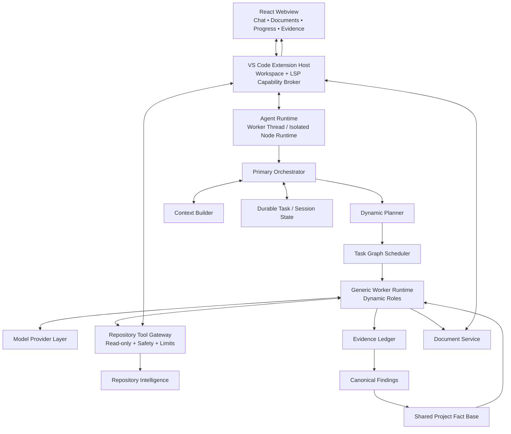
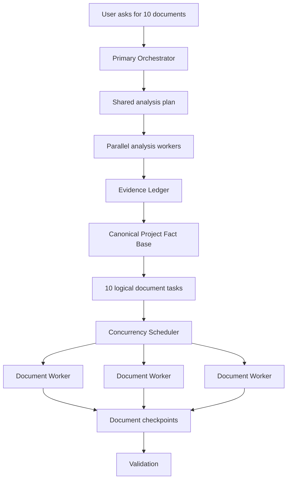
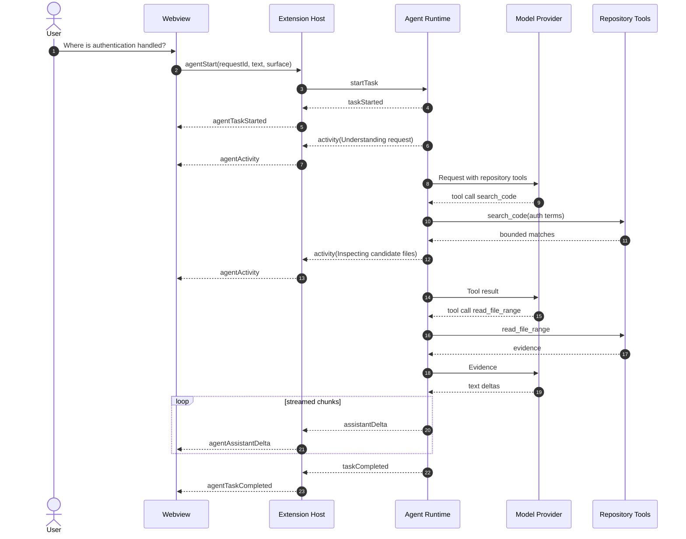
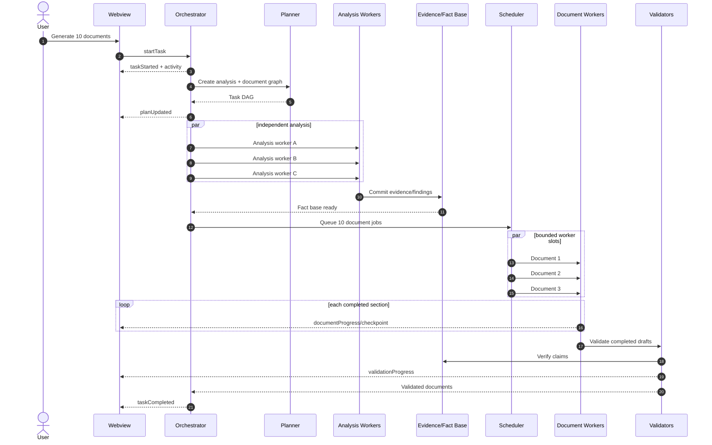

# CharterAI Agent — Complete Implementation Plan

**Status:** Proposed implementation plan  
**Scope:** New read-only AI analysis and documentation agent for the existing CharterAI VS Code extension  
**Codebase baseline:** Current source tree only. No deleted/previous agent implementation or repository history is used as a design input.  
**Primary goals:** repository-grounded answers, long-running/resumable analysis, dynamic subagents, parallel document generation, live streaming UX, evidence-backed claims, and safe read-only repository access.

---

## 1. Executive Architecture Decision

Implement CharterAI as an **evidence-centric hierarchical plan-and-execute agent with a bounded ReAct fast path**.

The system has one persistent primary orchestrator. Simple questions use a direct tool-using loop. Complex repository-wide or multi-document requests are decomposed into a durable task graph. Generic worker runtimes execute dynamically generated roles such as "OAuth Migration Analyst", "Data Retention Analyst", or "Feature Flag Architecture Analyst". These roles are not hard-coded classes.

Repository truth is centralized through deterministic repository tools, an evidence ledger, canonical findings, and a shared project fact base. Document workers consume that shared knowledge instead of independently re-analyzing the repository.

The user experience is event-streamed from the beginning. Users see task acknowledgement, real activity, assistant text deltas, document progress, validation progress, completion, cancellation, and recoverable failures without waiting for an entire long-running operation to finish.

### Target architecture



---

# 2. Current Codebase Baseline

The existing extension already has several boundaries that should be preserved.

## 2.1 Extension host

`extension/extension.ts` currently owns:

- VS Code activation.
- Webview creation.
- Webview message handling.
- Workspace discovery.
- Canvas load/save.
- Document-type load/save.
- Markdown export.
- The current chat stub.

This should remain the **VS Code capability boundary**, but it must stop being the location where all agent logic accumulates.

## 2.2 Protocol

`extension/protocol.ts` currently defines a simple request/response chat protocol:

- `chatMessage`
- `chatStatus`
- `chatResponse`

It also sends recent UI chat history with every user message. This is incompatible with durable sessions, parallel tasks, streaming, resumability, and multi-worker execution.

## 2.3 Chat UI

`src/hooks/useChat.ts` currently:

- Stores chat messages in React state.
- Sends the latest 12 UI messages to the extension.
- Waits for one final response.
- Uses a single `statusText`.
- Uses one 180-second timeout.

`src/components/chat/ChatPanel.tsx` already provides a usable foundation:

- User/assistant bubbles.
- Temporary assistant status.
- Typing indicator.
- Send and clear controls.

The new implementation should evolve these components rather than throw them away.

## 2.4 Document model

`src/types/document.ts` defines a stable `CanvasDocument` based on BlockNote blocks.

`src/hooks/usePhaseDocument.ts` already provides important behavior:

- Workspace-scoped local cache.
- Extension-host disk persistence.
- Debounced saves.
- Protection against a late disk load clobbering unsaved user edits.
- External document replacement support.

The agent should generate documents into this existing model through a deterministic document-rendering layer.

## 2.5 Document registry

`src/data/documentTypes.ts` currently makes the webview/localStorage the primary runtime registry for custom documents and mirrors them to disk through the extension.

This is adequate for manual UI-only document creation, but is not sufficient when an extension-side long-running agent must create ten documents while the webview is hidden, disposed, or reloading.

Canonical document-registry authority therefore needs to move to the extension side before multi-document generation is considered complete.

## 2.6 Persistence

`extension/formStateManager.ts` stores user-facing document JSON under `.charter-ai/` and supports the existing document type registry.

Continue using `.charter-ai/` for **explicit user project artifacts**.

Do not store private internal agent indexes, raw evidence caches, provider secrets, or task execution internals there by default. Those belong in extension-controlled workspace storage and VS Code `SecretStorage`.

## 2.7 Repository search capability

`@vscode/ripgrep` is already a runtime dependency. It should become the initial deterministic lexical search primitive for the repository intelligence layer.

---

# 3. Architectural Principles and Non-Negotiable Requirements

## 3.1 Hard-code capabilities, not expertise

The codebase should implement a small number of worker runtimes:

- Repository exploration worker.
- Analysis worker.
- Document worker.
- Validation worker.

The planner dynamically creates roles such as:

- Security analyst.
- GDPR readiness analyst.
- Cloud migration analyst.
- API governance analyst.
- Technical due-diligence analyst.
- Accessibility analyst.
- Feature-flag architecture analyst.

There must not be a `SecurityAgent.ts`, `UXAgent.ts`, `ScalabilityAgent.ts`, etc. for every scenario.

## 3.2 Repository truth must be shared

Parallel workers may investigate independently, but their durable output must be normalized into:

1. Evidence.
2. Findings.
3. Canonical project facts.

Ten document workers must not build ten independent models of the repository.

## 3.3 Read-only by construction

The agent is not a coding agent.

The model must not have tools for:

- Writing repository source.
- Patching code.
- Running arbitrary shell commands.
- Deleting files.
- Committing Git changes.

Read-only enforcement should come from the absence of these tools, not from a prompt asking the model to behave.

## 3.4 Deterministic infrastructure before LLM reasoning

Use deterministic systems for:

- File listing.
- File search.
- Regex/content search.
- File/range reading.
- Symbols.
- Definitions/references.
- Package manifests.
- Import relationships where supported.
- Git metadata.
- Output limiting.
- Secret filtering.
- State persistence.

Use LLMs for:

- Deciding what information is still needed.
- Formulating searches.
- Interpreting evidence.
- Planning complex analyses.
- Synthesizing conclusions.
- Producing documents.
- Validating whether claims follow from evidence.

## 3.5 Streaming must be a first-class protocol

Streaming is not a UI patch applied after the agent is complete. All runtime APIs must be event-driven from the start.

## 3.6 Never stream private chain-of-thought

The UI may show operational activity such as:

- "Inspecting authentication entry points"
- "Searching 18 matching files"
- "Generating section 4 of 9"
- "Validating architecture claims"

It must not expose hidden reasoning traces.

## 3.7 User edits always beat agent writes

If the user edits a document while the agent is generating it, the agent must not silently replace those edits.

## 3.8 Long tasks must be resumable

A task that has already completed repository analysis should not restart from zero after:

- Webview disposal.
- VS Code reload.
- Provider outage.
- Temporary model failure.
- Extension-host restart.

---

# 4. Implementation Sequence Overview

The recommended delivery order is:

1. **Phase 0 — Contracts, invariants, and evaluation baseline**
2. **Phase 1 — Streaming protocol and frontend agent UX**
3. **Phase 2 — Agent runtime isolation, sessions, cancellation, and task lifecycle**
4. **Phase 3 — Model-provider abstraction and secure provider configuration**
5. **Phase 4 — Read-only Repository Tool Gateway**
6. **Phase 5 — Repository Intelligence v1: discovery, catalog, Ripgrep, bounded reads**
7. **Phase 6 — LSP, symbols, definitions/references, and dependency intelligence**
8. **Phase 7 — Evidence ledger, findings, and canonical project fact base**
9. **Phase 8 — Dynamic planning and durable task graph**
10. **Phase 9 — Generic dynamic worker/subagent runtime**
11. **Phase 10 — Context engineering, session memory, budgets, and compaction**
12. **Phase 11 — Document authority, revision safety, and deterministic document IR**
13. **Phase 12 — Parallel multi-document generation with live document progress**
14. **Phase 13 — Evidence and cross-document validation**
15. **Phase 14 — Restart recovery, failure handling, retries, and partial completion**
16. **Phase 15 — Large repository scale, incremental indexing, and cache invalidation**
17. **Phase 16 — Observability, cost controls, model routing, and production hardening**
18. **Phase 17 — Evaluation gates and rollout**

The ordering is intentional. For example, subagents should not be implemented before evidence/state contracts exist, because otherwise they will exchange unstructured prose and create exactly the consistency problem the architecture is intended to solve.

---

# 5. Phase 0 — Define Contracts, Invariants, and Evaluation Baseline

## Goal

Freeze the behavioral contracts before writing orchestration code.

## Why this phase exists

Agent projects become difficult to maintain when tool schemas, state formats, streaming events, and completion criteria emerge organically inside prompts. This phase prevents the model from becoming the de facto architecture.

It also gives the team a way to measure whether later additions such as embeddings or additional workers improve the product instead of merely increasing complexity.

## Required implementation

Create architecture/type modules for:

- `AgentTask`
- `AgentEvent`
- `TaskNode`
- `WorkerSpec`
- `ToolDefinition`
- `ToolResult`
- `EvidenceRecord`
- `Finding`
- `ProjectFact`
- `DocumentSpec`
- `DocumentGenerationState`
- `RepositoryVersion`

Recommended initial locations:

```text
extension/agent/contracts/
  AgentTask.ts
  AgentEvent.ts
  TaskGraph.ts
  WorkerSpec.ts
  Evidence.ts
  DocumentSpec.ts
```

Add runtime schema validation. `zod` is a reasonable new runtime dependency because model/tool boundaries need runtime validation; TypeScript types alone do not validate model output.

## Core invariants

Document these as executable assertions where possible:

1. An agent task always has a stable `taskId`.
2. Every streamed event belongs to a task and has a monotonically increasing `seq`.
3. Every repository fact that claims current implementation behavior has evidence or is explicitly marked inferred/unknown.
4. Workers never directly mutate shared fact state; findings pass through a normalization/commit step.
5. Repository tools are read-only.
6. Provider credentials never enter webview state.
7. Raw repository content is never written to telemetry.
8. A document write must be revision-safe.
9. Completed task nodes are durable before dependent nodes start.
10. Context compaction cannot delete persisted evidence.

## User stories

### US-0.1 — Trustworthy repository answers

**As a user**, I want CharterAI to distinguish repository facts from recommendations so that generated documentation does not present speculation as implementation reality.

### US-0.2 — Reliable long-running execution

**As a user**, I want a several-minute analysis to preserve completed work if something transient fails.

### US-0.3 — Measurable quality

**As the product team**, we want repeatable repository questions with known expected evidence so architectural changes can be evaluated objectively.

## Evaluation fixture set

Create representative repositories or fixtures and questions such as:

- Where is authentication enforced?
- Trace user registration from route to persistence.
- What consumes the billing service?
- Which modules are responsible for caching?
- What are the main architectural boundaries?
- Produce a security architecture outline grounded in code.
- Generate three documents and verify shared facts remain consistent.

Track at least:

- Retrieval recall at K.
- Unsupported repository claim rate.
- Evidence precision.
- Repeated read rate.
- Task completion rate.
- First-visible-feedback latency.
- First-text-token latency.
- Total task latency.
- Token usage.

## Edge cases

- Repository has no recognizable package manifest.
- Repository is primarily configuration rather than source.
- Language has weak/no LSP support.
- User request contains no repository-related requirement.
- A fact cannot be proven from repository evidence.

## Acceptance criteria

- Core contracts are committed before model orchestration begins.
- Schemas are runtime validated.
- At least one evaluation fixture exists for simple retrieval and one for multi-document work.
- Unsupported facts have a defined representation (`unknown`, `inferred`, or `proposed`).

---

# 6. Phase 1 — Streaming Protocol and Frontend Agent UX

## Goal

Replace one-shot `chatMessage → chatResponse` behavior with task-scoped streaming events before implementing agent intelligence.

## Why this phase exists

The desired UX requires users to see meaningful activity during repository exploration and document generation. If streaming is added after the runtime is built, every layer will have blocking request/response assumptions that must later be rewritten.

The current `chatStatus` string is also insufficient when several subtasks or documents run concurrently.

## Current files affected

- `extension/protocol.ts`
- `extension/extension.ts`
- `src/hooks/useChat.ts`
- `src/components/chat/ChatPanel.tsx`
- `src/App.tsx`
- New UI components under `src/components/chat/`

## Protocol changes

Replace the chat-only protocol with task commands.

### Webview → extension

```ts
type WebviewToExtensionAgentMessage =
  | {
      type: 'agentStart'
      requestId: string
      text: string
      surface: {
        page: string
        activeDocumentId?: string
      }
    }
  | {
      type: 'agentCancel'
      taskId: string
    }
  | {
      type: 'agentResume'
      taskId: string
    }
  | {
      type: 'agentLoadSession'
      sessionId?: string
    }
```

Do **not** send the last 12 chat messages on every request. The runtime will own session history.

### Extension → webview

Create a common event envelope:

```ts
interface AgentEventBase {
  type: string
  taskId: string
  seq: number
  timestamp: number
}
```

Initial event set:

```text
agentTaskStarted
agentActivity
agentAssistantStarted
agentAssistantDelta
agentAssistantCompleted
agentPlanUpdated
agentDocumentDeclared
agentDocumentProgress
agentDocumentCheckpoint
agentValidationProgress
agentTaskCompleted
agentTaskFailed
agentTaskCancelled
agentTaskPaused
agentSessionSnapshot
```

## Streaming UX behavior

### Immediate acknowledgement

As soon as the extension accepts a request, send `agentTaskStarted` before any model call.

The UI should immediately show a task shell such as:

> Understanding your request…

This is real state, not simulated typing.

### Activity streaming

Send meaningful activity transitions:

```text
Understanding request
Scanning repository structure
Searching authentication entry points
Inspecting 6 candidate files
Building architecture findings
Generating System Architecture — section 3/8
Validating 14 repository claims
```

Do not expose hidden reasoning.

### Text streaming

When the model emits assistant text, send `agentAssistantDelta` chunks.

Do not post one VS Code message per provider token. Add a `StreamCoalescer` that batches deltas for approximately 30–75 ms or a small character threshold.

Target: roughly 10–20 UI updates/second at most during heavy streaming.

### Chat rendering changes

Rewrite `useChat.ts` into something closer to `useAgentSession.ts`.

It should maintain:

```ts
interface AgentUiState {
  sessionId: string | null
  activeTaskId: string | null
  messages: ChatMessage[]
  activities: AgentActivity[]
  plan?: PlanView
  documents: DocumentProgress[]
  taskStatus: 'idle' | 'running' | 'paused' | 'failed'
}
```

When `agentAssistantStarted` arrives, create an empty assistant message.

When deltas arrive, append to that same message.

### Scroll behavior

The current `ChatPanel` always scrolls to the bottom when messages/status change. Streaming would make that continuously pull the user away from text they are reading.

Change behavior to:

- Auto-follow only if the user is already near the bottom.
- If the user scrolls upward, stop auto-following.
- Show a small "Jump to latest" control while new content arrives.

### Input behavior

For v1, allow one foreground task per session.

While a task is active:

- Replace the Send button with a Stop button.
- Do not silently accept a second concurrent user request into the same task.
- Later, add task steering/queued messages if product requirements justify it.

## User stories

### US-1.1 — Immediate feedback

**As a user**, when I ask a repository question, I want visible confirmation immediately so I know the extension received my request.

### US-1.2 — Live answer

**As a user**, I want the assistant answer to appear progressively instead of waiting for the complete model response.

### US-1.3 — Long task visibility

**As a user**, when CharterAI spends minutes analyzing a repository or generating documents, I want to see what stage is currently active.

### US-1.4 — Cancellation

**As a user**, I want to stop a long-running request without closing VS Code.

### US-1.5 — Read while streaming

**As a user**, I want to scroll up and read previous content without the streaming UI constantly forcing me back to the bottom.

## Requirement considerations

### Functional

- Events ordered by `seq`.
- Duplicate events are ignored idempotently.
- Missing sequence numbers trigger a session/task snapshot reconciliation.
- Streaming supports both plain answers and document-generating tasks.
- Cancellation is visible immediately.

### Performance

- Avoid render-per-token.
- Do not copy the full message list for every tiny delta if avoidable.
- Batch provider deltas.

### UX

- Never fake percentage completion when actual completion cannot be measured.
- Percentages are allowed for deterministic section/node progress.
- Display high-level operational actions, not chain-of-thought.

## Edge cases

- Provider sends no text for 30 seconds while tools are executing.
- Delta arrives after task cancellation.
- Duplicate event delivered after webview remount.
- Webview reloads halfway through streaming.
- User closes the chat panel but task remains active.
- Assistant returns tool calls before any text.
- Huge streamed answer causes Markdown rendering slowdown.
- Task fails after partial text has already streamed.

## Acceptance criteria

- UI receives `agentTaskStarted` without waiting for an LLM response.
- Text appears incrementally from a mocked streaming provider.
- A 10,000-character streamed answer does not cause obvious UI lockups.
- Cancel stops further visible deltas for the task.
- Scrolling upward does not get overridden by incoming chunks.
- Refresh/remount can reconstruct task UI from an event/session snapshot.

---

# 7. Phase 2 — Agent Runtime Isolation, Sessions, Cancellation, and Task Lifecycle

## Goal

Introduce a dedicated agent runtime boundary instead of placing orchestration inside `extension/extension.ts`.

## Why this phase exists

The extension host owns VS Code APIs and UI messaging. Long model loops, planning, retries, and parallel document generation should not turn `extension.ts` into a monolith or risk blocking extension-host responsiveness.

An isolated Node worker also creates a clean cancellation/crash boundary.

## Implementation approach

Add a Node worker-thread entrypoint, for example:

```text
extension/agent-worker/worker.ts
```

Build it as a separate artifact:

```text
out/extension.cjs
out/agent-worker.cjs
```

Update build scripts accordingly.

The extension host creates an `AgentRuntimeClient` that communicates with the worker using typed RPC/events.

### Extension host responsibilities

- VS Code API access.
- Workspace/document capability execution.
- LSP calls.
- SecretStorage access.
- Webview communication.
- Starting/stopping the worker.

### Worker responsibilities

- Session state.
- Task lifecycle.
- Orchestration.
- Planning.
- Worker execution.
- Model calls.
- Context construction.
- Evidence/finding orchestration.
- Retry logic.

## Session model

Start with one active conversation session per workspace.

The session must be extension/runtime-owned, not reconstructed from webview chat bubbles.

Suggested model:

```ts
interface AgentSession {
  id: string
  workspaceId: string
  createdAt: number
  updatedAt: number
  status: 'active' | 'archived'
  conversationSummary?: string
}
```

Each user request creates a task linked to the session.

The active UI page/document is request metadata, not the session identity.

## Task lifecycle

```text
created
→ running
→ completed

created/running
→ cancelled

running
→ paused
→ running

running
→ failed
```

Use a task-level `AbortController`, with child controllers for model calls and workers.

## User stories

### US-2.1 — Persistent conversation

**As a user**, I want CharterAI to remember the current project conversation even if I navigate between documents.

### US-2.2 — Safe cancellation

**As a user**, stopping a task should cancel model calls and child work rather than only hiding the spinner.

### US-2.3 — Webview independence

**As a user**, hiding or reopening the CharterAI UI should not corrupt the currently running task.

## Edge cases

- Worker crashes unexpectedly.
- Extension host shuts down while worker is active.
- Webview posts cancel for an already completed task.
- Two `agentStart` messages accidentally share a `requestId`.
- User switches workspace while a task is running.
- Worker has stale workspace identity.

## Acceptance criteria

- `extension.ts` delegates agent work to `AgentRuntimeClient`.
- Agent execution does not depend on React state.
- Cancellation reaches in-flight model requests and worker tasks.
- Duplicate `requestId` is idempotent.
- Worker failure results in a structured task failure event rather than extension crash.

---

# 8. Phase 3 — Model Provider Abstraction and Secure Configuration

## Goal

Implement one clean streaming/tool-capable model interface without coupling orchestration to a specific provider SDK.

## Why this phase exists

The architecture requires different model roles over time and must survive provider changes, rate limits, outages, and possibly local models. Provider-specific response formats must not leak throughout the agent runtime.

Security also needs to exist before repository content is sent remotely.

## Provider interface

```ts
interface ModelProvider {
  stream(request: ModelRequest, signal: AbortSignal): AsyncIterable<ModelEvent>
}
```

Normalized model events:

```text
text_delta
tool_call_started
tool_call_delta
tool_call_completed
usage
finish
provider_warning
```

Normalized request:

```ts
interface ModelRequest {
  model: string
  system: string
  messages: ModelMessage[]
  tools: ModelToolDefinition[]
  temperature?: number
  maxOutputTokens?: number
}
```

## Configuration

- Store API credentials using `context.secrets` / VS Code `SecretStorage`.
- Store non-secret preferences in VS Code settings.
- Never send API keys to the webview.
- Do not store them under `.charter-ai/`.

## Initial model strategy

Start with one strong tool-capable reasoning model.

Do not implement complex cheap/strong model routing until usage telemetry exists.

The interface should support later routing without redesign.

## User stories

### US-3.1 — Secure credentials

**As a user**, I want my provider credentials stored securely and never exposed to the project or webview.

### US-3.2 — Streaming response

**As a user**, I want provider output surfaced as it is produced.

### US-3.3 — Provider failure clarity

**As a user**, I want rate-limit/provider failures explained without losing completed repository work.

## Edge cases

- Missing API key.
- Invalid API key.
- 401/403.
- 429 with retry headers.
- Provider 5xx.
- Connection reset mid-stream.
- Stream finishes without a completion event.
- Malformed tool arguments.
- Model generates an unknown tool name.
- User cancels during streaming.

## Acceptance criteria

- Provider is replaceable through an interface.
- Streaming text and tool calls are normalized.
- API key exists only in SecretStorage/runtime memory.
- AbortSignal interrupts provider streaming.
- Provider errors are normalized into retryable/non-retryable categories.

---

# 9. Phase 4 — Read-Only Repository Tool Gateway

## Goal

Build the safe deterministic API through which every agent/worker accesses repository information.

## Why this phase exists

The LLM should never receive direct filesystem access or arbitrary shell execution. A centralized gateway gives one place for validation, workspace isolation, secret filtering, output limits, caching, and observability.

This is **not** an interactive code-modification permission gateway. The product is read-only.

## Responsibilities

```text
Schema validation
Workspace containment
Read-only enforcement
Sensitive-file policy
Secret redaction
Output limits
Timeouts
Error normalization
Metrics
Tool execution
```

## Initial tool contract

Implement typed registration:

```ts
interface RepositoryTool<I, O> {
  name: string
  description: string
  inputSchema: ZodSchema<I>
  execute(input: I, context: ToolContext): Promise<ToolResult<O>>
}
```

Common result envelope:

```ts
interface ToolResult<T> {
  data: T
  truncated: boolean
  nextCursor?: string
  warnings?: string[]
  repositoryVersion: string
  evidenceCandidates?: EvidenceCandidate[]
}
```

## Security policy

Default-block or redact obvious sensitive paths/content:

- `.env`
- `.env.*` except safe examples/templates
- private keys
- credential files
- cloud credential folders
- obvious secret dumps

Reject paths outside configured workspace roots.

## User stories

### US-4.1 — Repository privacy

**As a user**, I want CharterAI to analyze my source without accidentally sending credential files to a remote model.

### US-4.2 — Predictable tool behavior

**As the agent runtime**, I need repository tools with bounded outputs so one operation cannot explode model context.

## Edge cases

- Symlink points outside workspace.
- File changes between validation and read.
- Path differs only by case on case-insensitive filesystem.
- Virtual/non-file workspace.
- Binary file.
- Minified 20 MB JavaScript file.
- One line is several megabytes.
- `.env.example` should be readable while `.env.production` is blocked.

## Acceptance criteria

- No write/shell tool exists.
- Path traversal outside workspace is rejected.
- Sensitive paths are filtered before provider context.
- Every tool has explicit output limits.
- Tool exceptions become structured errors.

---

# 10. Phase 5 — Repository Intelligence v1

## Goal

Make the agent useful on real repositories using deterministic discovery, lexical search, and bounded file reads before adding advanced indexing.

## Why this phase exists

Most repository questions can be solved effectively with high-quality file discovery + Ripgrep + bounded reading. This provides a strong baseline and avoids prematurely committing to embeddings or expensive indexing.

## Components

Create:

```text
extension/repository/
  RepositoryService.ts
  FileCatalog.ts
  RipgrepSearch.ts
  FileReader.ts
  ProjectDiscovery.ts
  PackageInspector.ts
  IgnorePolicy.ts
  OutputLimiter.ts
```

## Tools implemented in this phase

### `list_files`

Purpose: browse a directory/package without returning source content.

Input:

```text
root/scope
path
pattern
cursor
limit
```

Output:

```text
paths
kind
language/extension
size
flags: generated/vendor/test/config
nextCursor
```

### `search_files`

Purpose: locate likely files from path/name terms.

Implementation: file catalog and/or Ripgrep glob/path matching.

### `search_code`

Purpose: regex/text search.

Implementation: `@vscode/ripgrep`.

Limits:

- Match count cap.
- Per-line truncation.
- Overall byte cap.
- Pagination/refinement signal.

### `read_file`

Only return whole file if below a safe configured size.

Otherwise return metadata and instruct caller to use `read_file_range`.

### `read_file_range`

Return numbered bounded source ranges.

Suggested starting limits:

- Up to ~300–500 lines.
- Up to ~32–64 KB, whichever is reached first.

Make limits configurable after benchmarking.

### `get_project_structure`

Return package/module topology rather than dumping every path.

### `get_package_info`

Parse common manifests deterministically.

## Current unsaved editor state

When reading a file that is open and dirty in VS Code, prefer the current in-memory text document over disk contents.

This is necessary because the user expects CharterAI to reason about the code they are currently seeing, not only the last saved version.

## Ignore policy

Default-deprioritize or exclude:

- `.git`
- dependency vendor folders (`node_modules`, etc.)
- build output
- generated code
- binaries
- large lock files from ordinary content retrieval

Do not permanently make them invisible; specific tasks may need package lock or generated schema metadata.

## User stories

### US-5.1 — Locate implementation

**As a user**, I can ask "where is login implemented?" and get a grounded response without indexing the entire repository into the model context.

### US-5.2 — Large file handling

**As a user**, a huge generated file should not freeze the agent or consume the whole context window.

### US-5.3 — Unsaved code awareness

**As a developer**, if I have unsaved changes open in the editor, CharterAI should analyze those current changes when it reads that file.

## Edge cases

- 0-byte files.
- Binary files.
- Very long lines.
- Search returns 10,000 matches.
- Search regex invalid.
- File is deleted after search but before read.
- Filename contains Unicode.
- Multi-root VS Code workspace.
- Remote SSH/container workspace.

## Multi-root requirement

The current `workspaceRoot()` uses the first workspace folder. Preserve that behavior for existing `.charter-ai` document storage initially, but repository analysis should introduce a `WorkspaceDescriptor` containing **all** analysis roots.

Do not silently ignore secondary workspace folders.

## Acceptance criteria

- Agent can solve benchmark retrieval questions using only these tools.
- No whole-repository content is loaded into model context.
- Search/read outputs are bounded.
- Dirty open buffers are preferred over stale disk content.
- Multi-root capability is represented explicitly even if the first release limits some operations.

---

# 11. Phase 6 — LSP, Symbols, References, and Dependency Intelligence

## Goal

Add deterministic semantic structure so the agent does not rely only on lexical search for architecture-level analysis.

## Why this phase exists

Questions such as "what depends on this service?", "where is this interface implemented?", or "how does this call flow propagate?" are better answered through language intelligence than through an LLM inventing search heuristics.

## VS Code/LSP capabilities

Use VS Code language providers through extension-host RPC for:

- Workspace symbols.
- Document symbols.
- Definitions.
- References.
- Implementations where available.
- Call hierarchy where supported.
- Diagnostics where useful.

Tools:

```text
find_symbol
find_definition
find_references
find_implementations
get_document_symbols
get_diagnostics
```

## Dependency graph

Add a language-adapter interface:

```ts
interface DependencyAdapter {
  supports(languageId: string): boolean
  extractImports(document: SourceDocument): Promise<ImportEdge[]>
}
```

Start with the highest-value languages supported by your target customers rather than pretending all languages can be parsed equally well.

Tools:

```text
get_imports
get_dependencies
get_dependents
```

For unsupported languages, fall back to LSP/lexical evidence and mark capability limitations.

## Capability reporting

Expose:

```text
get_repository_capabilities
```

Example output:

```json
{
  "typescript": {
    "lsp": true,
    "definitions": true,
    "references": true,
    "importGraph": true
  },
  "terraform": {
    "lsp": false,
    "importGraph": false,
    "lexicalSearch": true
  }
}
```

This allows the planner to adjust confidence and methodology.

## User stories

### US-6.1 — Trace dependencies

**As a user**, I want CharterAI to identify what depends on a component using actual references/imports where available.

### US-6.2 — Transparent limitations

**As a user**, if the repository language lacks semantic tooling, I want conclusions to reflect that limitation instead of pretending certainty.

## Edge cases

- Language server still starting.
- Language server crashes.
- Provider returns thousands of references.
- Symbol name is ambiguous.
- Monorepo has duplicate symbol names.
- Generated declaration files dominate results.
- Language provider returns locations outside the workspace.

## Acceptance criteria

- LSP failures degrade to lexical retrieval rather than failing the task.
- Reference results are paginated/limited.
- Repository capability status is queryable.
- Dependency edges record provenance so the system knows whether they came from parser, LSP, manifest, or inference.

---

# 12. Phase 7 — Evidence Ledger, Findings, and Canonical Project Fact Base

## Goal

Create the durable knowledge layer that separates CharterAI from a normal chat-with-files implementation.

## Why this phase exists

Multiple workers and documents cannot remain consistent if they only exchange prose. Repository observations need stable provenance and lifecycle semantics.

## Evidence model

```ts
interface EvidenceRecord {
  id: string
  repositoryVersion: string
  path: string
  contentHash: string
  symbol?: string
  range?: { startLine: number; endLine: number }
  kind: 'source' | 'manifest' | 'git' | 'lsp' | 'structure'
  excerpt?: string
  sourceTool: string
  createdAt: number
}
```

Do not necessarily store large source excerpts forever. Evidence may store a bounded excerpt plus enough information to deterministically re-read the exact source.

## Finding model

```ts
interface Finding {
  id: string
  claim: string
  type: 'observed' | 'inferred' | 'proposed' | 'unknown'
  domain: string
  evidenceIds: string[]
  confidence: 'high' | 'medium' | 'low'
  assumptions: string[]
  contradictions: string[]
  repositoryVersion: string
}
```

## Canonical fact model

A canonical project fact is a normalized, accepted finding that can be reused across tasks/documents.

Examples:

```text
Runtime: Node.js
Primary database: PostgreSQL
Authentication mechanism: JWT + provider X
Frontend framework: React
API transport: REST
```

Facts must retain provenance.

## No chain-of-thought storage

Persist concise rationale/provenance, not private model scratch reasoning.

## Invalidation

Every evidence item depends on a file hash/repository version.

When a source file changes:

- Mark evidence for that file stale.
- Mark dependent findings as needing revalidation.
- Do not immediately delete unrelated project facts.

## User stories

### US-7.1 — Clickable evidence

**As a user**, I want important statements in CharterAI output to be traceable to concrete files/symbols/locations.

### US-7.2 — Consistent documents

**As a user**, I want a PRD, architecture doc, and security doc generated in the same project to agree on established repository facts.

### US-7.3 — Honest uncertainty

**As a user**, I want CharterAI to say when something is inferred or unknown rather than manufacturing certainty.

## Edge cases

- Same claim has contradictory evidence.
- Evidence file changed after finding was generated.
- Line numbers shift while symbol remains semantically identical.
- Finding references a deleted file.
- Two workers independently produce equivalent facts with different wording.

## Acceptance criteria

- Repository claims can point to evidence IDs.
- Equivalent findings can be normalized/deduplicated.
- Stale evidence is detectable.
- `observed`, `inferred`, `proposed`, and `unknown` remain distinct through document generation.

---

# 13. Phase 8 — Dynamic Planning and Durable Task Graph

## Goal

Turn complex requests into explicit, resumable, dependency-aware work while preserving a fast path for simple questions.

## Why this phase exists

Pure ReAct is excellent for small repository questions but weak for ensuring full coverage of a request such as "create a complete security architecture document" or "generate ten different project documents".

A durable graph provides coverage, parallelism, retries, partial completion, progress UX, and resume semantics.

## Complexity routing

Use deterministic heuristics first, optionally assisted by a structured classifier.

Simple examples:

- "Where is authentication handled?"
- "What database are we using?"
- "Explain this service."

Complex examples:

- "Analyze the complete architecture."
- "Create a security architecture document."
- "Generate ten project documents."
- "Perform technical due diligence."

Simple requests use a bounded tool loop.

Complex requests create a task graph.

## Task node contract

```ts
interface TaskNode {
  id: string
  title: string
  objective: string
  dependencies: string[]
  roleSpec: WorkerSpec
  requiredCoverage: string[]
  requiredEvidence: string[]
  status: 'queued' | 'running' | 'completed' | 'failed' | 'blocked' | 'cancelled'
  attempts: number
  budget: TaskBudget
  outputs: string[]
}
```

## Dynamic replanning

The initial graph is not immutable.

A worker can return:

```text
new_questions
missing_coverage
contradictions
recommended_followups
```

The orchestrator may add nodes if they are necessary to satisfy the original request.

## Completion gates

Nodes complete based on explicit coverage rules, not merely a model saying "done".

Example authentication coverage:

```text
Entry points identified or explicitly unknown
Credential/token mechanism identified
Validation/enforcement location checked
Authorization boundary checked where applicable
Evidence recorded
Unknowns recorded
```

## User stories

### US-8.1 — Complete analysis

**As a user**, when I request a "complete" security or architecture analysis, I want important domains tracked explicitly instead of relying on the model to remember everything in one conversation.

### US-8.2 — Visible plan

**As a user**, I want to see a concise live plan/progress view for long tasks.

### US-8.3 — Partial success

**As a user**, if one part of a ten-part analysis fails, I want the other successful work preserved.

## Edge cases

- Planner creates circular dependencies.
- Planner creates hundreds of tiny nodes.
- New findings invalidate an earlier node conclusion.
- One required domain has no repository evidence.
- Planner repeatedly adds follow-up nodes without increasing coverage.

## Acceptance criteria

- Graph is validated as acyclic before scheduling.
- Configurable max node count exists.
- Graph changes are persisted and streamed to UI.
- Replanning has a bounded budget.
- No-new-evidence loop detection can terminate/replan a stalled task.

---

# 14. Phase 9 — Generic Dynamic Worker/Subagent Runtime

## Goal

Add bounded subagents without hard-coding domain-specific agent classes.

## Why this phase exists

Thousands of documentation scenarios are possible. Hard-coded `SecurityAgent`, `UXAgent`, etc. would make product capability depend on engineering changes for every new domain.

The system should hard-code execution mechanics and dynamically provide expertise through a `WorkerSpec`.

## Hard-coded worker types

```text
RepositoryExplorerWorker
AnalysisWorker
DocumentWorker
ValidationWorker
```

These are runtime implementations, not domain experts.

## Dynamic worker specification

```ts
interface WorkerSpec {
  id: string
  workerType: 'repository' | 'analysis' | 'document' | 'validation'
  role: string
  objective: string
  scope: WorkerScope
  questions: string[]
  requiredCoverage: string[]
  allowedTools: RepositoryToolName[]
  inputFindingIds: string[]
  outputSchema: 'findings' | 'document-section' | 'validation'
  budget: TaskBudget
}
```

Example generated at runtime:

```json
{
  "workerType": "analysis",
  "role": "Cloud Migration Analyst",
  "objective": "Identify AWS-specific dependencies and Azure migration risks",
  "questions": [
    "Which AWS SDKs are used?",
    "Which services depend on S3 semantics?",
    "How are credentials configured?"
  ]
}
```

No `CloudMigrationAgent.ts` is created.

## Playbooks

Support optional reusable playbooks for common tasks:

```text
architecture
security
scalability
technical-debt
migration
PRD
```

Playbooks provide coverage guidance, not executable agent classes.

If no playbook exists, the planner generates coverage dynamically.

## Worker output

Analysis workers must return structured data:

```text
findings
evidence references
unknowns
contradictions
coverage achieved
recommended follow-ups
```

They must not communicate with other workers through free-form chat.

## Parallelism

Use a scheduler semaphore.

Initial conservative defaults might be:

```text
analysis concurrency: 2–3
document concurrency: 2–3
validation concurrency: 2
```

These are runtime limits, not limits on logical tasks.

Ten document tasks can therefore be queued concurrently while only three model calls run at a time.

## User stories

### US-9.1 — Novel documentation scenario

**As a user**, I can ask for a specialized document the product has never explicitly shipped, and CharterAI can dynamically plan the required analysis.

### US-9.2 — Parallel analysis

**As a user**, independent analysis domains should execute in parallel when this reduces total wait time.

## Edge cases

- Dynamic role attempts to request a forbidden tool.
- Two workers investigate the same source range.
- Workers produce contradictory findings.
- One worker exceeds budget.
- Provider rate limit lowers safe concurrency.
- Child task is cancelled after siblings finish.

## Acceptance criteria

- No domain-specific agent class is required to support a new analysis scenario.
- Worker tool access is constrained by `WorkerSpec` and global read-only policy.
- Parallel workers write through the evidence/finding commit layer.
- Repeated identical source reads can be served from evidence/read cache.

---

# 15. Phase 10 — Context Engineering, Session Memory, Budgets, and Compaction

## Goal

Keep long sessions and large repository tasks within finite context windows without losing important project evidence.

## Why this phase exists

The current UI sends a fixed truncated chat history. That approach cannot support long analyses, delegated work, or reliable resume behavior.

Context must be constructed from durable state according to the current task rather than equated with the full transcript.

## Context layers

### Session context

- Recent user/assistant conversation.
- Current user objective.
- Current surface/document context.

### Task context

- Active task node.
- Required coverage.
- Completed dependency outputs.
- Current unknowns.

### Repository knowledge

- Retrieved canonical findings.
- Evidence excerpts needed by this node.
- Relevant package/symbol metadata.

### Preferences/instructions

- Project-specific documentation preferences.
- User style preferences.
- Security/provider policy.

## Context ordering

Recommended priority:

1. System and safety rules.
2. Task objective and constraints.
3. Worker role specification.
4. Project/user instructions.
5. Required canonical findings.
6. Required evidence excerpts.
7. Recent conversation.
8. Recent tool results.

## Token budgets

Every model call should receive an explicit context budget.

The builder should allocate quotas rather than continuously append until overflow.

## Compaction

When approaching the limit:

1. Persist all newly produced evidence/findings/task progress.
2. Summarize old conversational/work state.
3. Preserve objective, decisions, unknowns, evidence IDs, active node, and recent turns.
4. Drop old raw tool bodies.
5. Re-read exact evidence later if needed.

## Read cache

Key bounded read results by:

```text
workspace/repository version
path
content hash
range
```

This reduces duplicate tool/model context work.

## User stories

### US-10.1 — Long conversation continuity

**As a user**, I can continue a long project analysis without the assistant forgetting core conclusions every few turns.

### US-10.2 — Evidence survives compaction

**As a user**, factual support for generated documents should remain valid even if old chat/tool output is removed from active model context.

## Edge cases

- Context limit reached during a tool-heavy turn.
- Summary itself becomes too large.
- Earlier conclusion becomes stale due to file modification.
- User asks about something from very old conversation not present in recent context.
- Ten documents require overlapping but not identical fact subsets.

## Acceptance criteria

- No model call depends on webview-supplied chat history.
- Compaction can occur without deleting evidence/finding state.
- Exact evidence can be rehydrated by ID.
- Context size is estimated before every model request.

---

# 16. Phase 11 — Document Authority, Revision Safety, and Deterministic Document IR

## Goal

Make agent-created/updated documents safe, durable, and compatible with the existing BlockNote canvas.

## Why this phase exists

The current document model is good, but the current webview-side document registry and external replacement behavior are not sufficient for background multi-document generation or concurrent user edits.

The LLM should also not stream partially valid BlockNote JSON into the editor.

## 16.1 Move canonical document registry authority to extension side

Create:

```text
extension/documents/DocumentRegistryService.ts
extension/documents/DocumentService.ts
```

The disk registry remains compatible with the existing `.charter-ai/doc-types.json` model.

The webview keeps a local cache for responsiveness, but mutations become extension-side commands:

```text
documentCreate
documentRename
documentDelete
documentMove
documentList
```

The extension pushes authoritative registry snapshots back to the webview.

This allows the agent runtime to create documents even when the webview is not currently mounted.

## 16.2 Revision/ETag model

Every load/save should have an extension-side revision token based on content hash or a monotonic record.

Conceptually:

```ts
interface DocumentSnapshot {
  documentId: string
  document: CanvasDocument
  revision: string
}
```

Webview save:

```text
saveCanvas(documentId, content, baseRevision)
```

If the current revision differs, return a conflict instead of silently overwriting.

## 16.3 Agent/user conflict behavior

When document generation starts, record `baseRevision`.

On each checkpoint:

- If current revision still equals expected revision: agent may save checkpoint.
- If user has edited: do not overwrite.
- Store the agent result as a pending agent draft/version.
- Notify UI that an agent update is available for review/apply.

## 16.4 Document IR

Do not ask the model to directly generate arbitrary BlockNote internals.

Define a validated intermediate representation, e.g.:

```ts
interface DocumentIR {
  title: string
  sections: DocumentSection[]
}
```

Section content supports controlled primitives:

```text
heading
paragraph
bullets
numbered list
table
callout
mermaid diagram
risk list
scope block
```

`DocumentRenderer` deterministically converts validated IR to the existing `CanvasDocument` / BlockNote shape.

## 16.5 Section-level checkpoints

Generate documents section by section.

After a complete section passes schema validation:

1. Update DocumentIR.
2. Render a complete valid CanvasDocument snapshot.
3. Save/checkpoint safely.
4. Emit `agentDocumentCheckpoint`.

Never stream incomplete JSON fragments into `DocumentCanvas`.

## User stories

### US-11.1 — Agent creates documents automatically

**As a user**, I can ask CharterAI for a new document and have it appear in the existing document grid/canvas without manually creating it first.

### US-11.2 — Live document progress

**As a user**, I can open a generating document and see completed sections appear incrementally.

### US-11.3 — Protect my edits

**As a user**, if I edit a document while CharterAI is generating it, my edits are never silently overwritten.

## Edge cases

- User edits same document during generation.
- User deletes document while worker generates it.
- User renames document while generation is active.
- Webview has stale localStorage copy.
- Agent checkpoint arrives out of order.
- Section generation fails after three successful sections.
- Invalid DocumentIR from model.

## Acceptance criteria

- Extension is canonical authority for agent-created document types.
- Document writes use revision-safe semantics.
- Agent output is converted through a validated IR.
- Canvas always receives valid complete BlockNote snapshots.
- User edits cannot be silently replaced.

---

# 17. Phase 12 — Parallel Multi-Document Generation With Live Progress

## Goal

Support requests such as "create these 10 documents" efficiently and visibly.

## Why this phase exists

This is a core product differentiator, but it should be built only after shared evidence, task graphs, dynamic workers, context management, and document revision safety exist.

Otherwise ten parallel document agents would redundantly inspect the repository and disagree with one another.

## Execution flow



## Important rule

**Parallelize document production, not repository truth.**

Repository/domain analysis happens once where possible, with shared findings.

Document workers query relevant subsets of the fact base.

## Document task state

```ts
interface DocumentGenerationState {
  documentId: string
  status: 'queued' | 'outlining' | 'generating' | 'validating' | 'completed' | 'failed'
  completedSections: number
  totalSections: number
  activeSection?: string
  error?: string
}
```

## UI behavior

For a ten-document task, show a compact progress list/card view:

```text
✓ PRD                         Complete
● System Architecture         Section 5/8
● Security Architecture       Validating
○ API Design                  Queued
○ Scalability                 Queued
...
```

Use deterministic section/node progress rather than fake token percentages.

## User stories

### US-12.1 — Generate many documents

**As a user**, I can request ten different documents in one instruction and let CharterAI create them as one coordinated task.

### US-12.2 — See progress before completion

**As a user**, I can see which documents are queued, generating, validating, completed, or failed.

### US-12.3 — Partial availability

**As a user**, I can open and read completed documents while other documents are still being generated.

### US-12.4 — Shared consistency

**As a user**, documents generated together should use the same established project facts and terminology.

## Edge cases

- Provider allows only one/two concurrent requests.
- One document is much larger than others.
- One document fails validation repeatedly.
- User cancels entire batch.
- Future enhancement: user cancels only one document.
- One document depends on findings generated by another analysis task.
- Fact base changes while later documents are queued.

## Acceptance criteria

- Ten logical document jobs can exist simultaneously.
- Physical provider concurrency is configurable and bounded.
- Completed documents remain available if another document fails.
- Each document can checkpoint section-by-section.
- Documents use a pinned/reproducible fact-base revision for a generation run unless explicitly refreshed.

---

# 18. Phase 13 — Evidence Validation and Cross-Document Consistency

## Goal

Validate that generated documents are grounded and mutually consistent.

## Why this phase exists

Good prose is not enough. CharterAI's value depends on being accurate about the actual codebase, especially for architecture/security/product planning.

## Validation layers

### Deterministic validation

Check:

- Evidence ID exists.
- Evidence file still exists.
- Content hash/repository version is current.
- Referenced symbol/range is resolvable.
- Required document sections exist.
- Required analysis domains completed or explicitly marked unknown.

### Model-based claim validation

For important repository claims:

1. Extract claim.
2. Resolve cited finding/evidence.
3. Provide bounded source evidence to validation worker.
4. Ask whether the evidence supports, weakly supports, or contradicts the claim.

Validation worker may request additional read-only retrieval.

### Cross-document consistency

Normalize important claims and compare across the document set:

- Technology choices.
- Auth architecture.
- Database/storage.
- API structure.
- Deployment model.
- Product terminology.
- Proposed decisions.

Conflicts are resolved against the shared fact base or marked explicitly unresolved.

## User stories

### US-13.1 — Grounded documentation

**As a user**, factual statements about my repository should be verifiable from source evidence.

### US-13.2 — Consistent document set

**As a user**, ten generated documents should not describe the same system in contradictory ways.

## Edge cases

- Evidence becomes stale during validation.
- Two valid implementations exist for different packages.
- Repository behavior is environment-dependent.
- A document intentionally contains a future proposal different from current implementation.
- Validation model disagrees with original analysis model.

## Acceptance criteria

- Current-state claims and proposed-state claims are validated differently.
- Stale evidence triggers refresh or caveat.
- Cross-document contradictions are surfaced before final completion.
- A validation failure can regenerate only the affected section rather than the entire document.

---

# 19. Phase 14 — Restart Recovery, Failure Handling, Retries, and Partial Completion

## Goal

Make long-running tasks operationally reliable.

## Why this phase exists

Several-minute tasks will encounter provider failures, restarts, cancellation, malformed outputs, and file changes. Without durable checkpoints, reliability will be unacceptable.

## Durable checkpoints

Persist transitions such as:

```text
task created
plan committed
node started
retrieval completed
evidence committed
finding committed
node completed
document outline committed
document section committed
validation committed
task completed
```

A dependent node should not start until its dependency output is durably committed.

## Retry taxonomy

### Retryable

- Network timeout.
- Connection reset.
- Provider 5xx.
- Rate limit.

Use exponential backoff + jitter + bounded attempts.

### Rebuild context and retry

- Context window exceeded.

### Model repair/replan

- Invalid structured output.
- Invalid tool arguments.

### Do not blindly retry

- Unauthorized API key.
- Forbidden model.
- Repeated deterministic tool error.
- User cancellation.

## Loop detection

Detect:

- Identical repeated tool calls.
- Same failed arguments repeatedly.
- Repeated searches producing no new files/evidence.
- Several iterations with zero coverage improvement.

On loop detection:

1. Stop current worker iteration.
2. Return structured stall reason.
3. Let orchestrator replan or terminate with a bounded partial result.

## Extension restart recovery

On `activate()`:

1. Load tasks whose durable state says `running` but no worker owner exists.
2. Mark them `interrupted`/`paused`.
3. Reconstruct active task graph.
4. Validate repository version.
5. Resume from first incomplete node or ask user only when repository changes make safe resume impossible.

## User stories

### US-14.1 — Resume after reload

**As a user**, if VS Code reloads during a large document-generation task, I want completed analysis and document sections preserved.

### US-14.2 — Partial output on failure

**As a user**, if one subtask fails, I want completed documents/findings rather than a generic total failure.

### US-14.3 — Meaningful retry behavior

**As a user**, transient provider problems should recover automatically without repeating all prior repository analysis.

## Edge cases

- Repository changed significantly during downtime.
- Provider returns rate limit for hours.
- Worker process dies while writing state.
- State file partially written.
- User deletes project directory.
- Resume occurs with a different workspace open.

## Acceptance criteria

- Durable writes use atomic temp-file + rename or equivalent.
- A crash cannot leave a task looking permanently `running` without an owner.
- Completed nodes are not repeated unnecessarily.
- Partial document sections survive failure.
- Cancellation state persists.

---

# 20. Phase 15 — Large Repository Scale, Incremental Indexing, and Cache Invalidation

## Goal

Support repositories from roughly 1,000 files to 100,000+ file monorepos without full-context or full-LLM indexing.

## Why this phase exists

The retrieval strategy must scale through progressive narrowing and incremental metadata, not by asking an LLM to summarize the entire repository.

## Repository discovery levels

### ~1,000 files

- Enumerate all eligible file metadata.
- Detect packages/manifests.
- Build lightweight catalog.
- Query LSP on demand.
- No eager LLM summaries.

### ~10,000 files

- Persist catalog.
- Incremental file-change processing.
- Package-scoped retrieval.
- Dependency metadata for supported languages.
- Lazy summaries for repeatedly relevant modules.

### 100,000+ files

Progressive narrowing:

```text
Workspace roots
→ package topology
→ relevant packages
→ modules
→ symbols/files
→ bounded source ranges
```

Avoid global source parsing unless measurements prove it is necessary.

## Incremental invalidation

Use:

- `workspace.onDidChangeTextDocument`
- save events
- filesystem watchers
- repository/file content hashes

Invalidate only affected:

- catalog entries.
- symbol/import metadata.
- summaries.
- evidence.
- dependent findings.

## Summary strategy

Summaries are lazy and content-hash keyed.

Possible hierarchy:

```text
file summary
→ module/package summary
```

Do not eagerly run an LLM across all files.

## Embeddings decision

Do **not** add repository embeddings in the initial implementation.

After the lexical + structural retrieval benchmark is established, add semantic retrieval only if it materially improves recall for real user queries.

If later added, semantic search is another candidate source, not the sole retrieval method.

## User stories

### US-15.1 — Monorepo analysis

**As a user**, I want CharterAI to analyze a 100k-file monorepo without attempting to read or summarize every file.

### US-15.2 — Fast repeat work

**As a user**, follow-up analysis should reuse unchanged repository knowledge rather than restarting discovery from zero.

## Edge cases

- Massive generated directories.
- Vendored third-party source.
- Symlink cycles.
- Package manifests change.
- Git branch changes thousands of files.
- User checks out another branch during active task.
- LSP indexing itself is not ready.

## Acceptance criteria

- Initial task does not require complete repository LLM summarization.
- Index update is incremental.
- Generated/vendor files are deprioritized by default.
- Repository version change can invalidate stale task evidence.
- Performance benchmark exists at 1k, 10k, and 100k+ file scales.

---

# 21. Phase 16 — Observability, Cost Controls, Model Routing, and Production Hardening

## Goal

Make the system diagnosable and economically predictable without leaking repository content.

## Why this phase exists

Agent failures are otherwise difficult to reproduce. Multi-worker workloads can also create unexpected token/concurrency costs.

## Local observability

Create a dedicated VS Code OutputChannel for safe operational diagnostics.

Track structured metadata:

- Task lifecycle.
- Node lifecycle.
- Tool type.
- Tool latency.
- Search result counts.
- Evidence count.
- Cache hit/miss.
- Model name.
- Input/output token counts.
- Model latency.
- Retry count.
- Compaction count.
- Worker concurrency.
- Validation failures.
- Estimated cost if provider pricing is configured.

## Never log by default

- Source code bodies.
- `.env` contents.
- Secrets.
- Full prompts containing code.
- Full model responses.
- Sensitive absolute paths to remote telemetry.

## Cost budgets

Define task-level limits:

```ts
interface TaskBudget {
  maxModelCalls: number
  maxToolCalls: number
  maxInputTokens: number
  maxOutputTokens: number
  maxParallelWorkers: number
  maxReplans: number
}
```

When approaching budget:

- Prefer synthesis from available evidence.
- Clearly mark uninvestigated/insufficient-evidence areas.
- Do not silently fabricate completion.

## Model routing

Initially use one strong model.

After telemetry:

Cheap/fast model candidates:

- Classification.
- Query rewriting.
- Simple extraction.
- Low-risk summaries.

Strong model candidates:

- Planning.
- Architecture reasoning.
- Security analysis.
- Contradiction resolution.
- Final synthesis.

Routing complexity should be justified by measured savings/quality.

## User stories

### US-16.1 — Predictable heavy tasks

**As a user**, I want large document-generation jobs to stay within sensible resource limits and tell me when analysis is incomplete.

### US-16.2 — Supportability

**As the engineering team**, we need enough safe diagnostics to understand why a task was slow or failed without recording customers' source code.

## Edge cases

- Token usage unavailable from provider.
- One worker consumes most of task budget.
- Validation pushes total cost beyond original generation.
- Telemetry disabled.
- Logs accidentally receive tool payloads through thrown errors.

## Acceptance criteria

- Repository content is redacted/excluded from standard logs.
- Task budgets are enforced in code.
- Usage is attributable by task/node/worker.
- Concurrency can react to provider rate-limit pressure.

---

# 22. Phase 17 — Evaluation Gates and Rollout

## Goal

Ship incrementally without exposing unfinished "agent magic" as production capability.

## Why this phase exists

A sophisticated agent can appear impressive in demos while having poor retrieval recall or unsupported factual claims. Release gates should be tied to observed reliability.

## Suggested rollout stages

### Gate A — Streaming shell

Ship internally when:

- Task protocol works.
- Cancellation works.
- Streaming UI is stable.
- No agent intelligence required yet.

### Gate B — Simple repository Q&A

Ship to testers when:

- Deterministic read/search tools pass safety tests.
- Retrieval benchmark meets target.
- Evidence links are available.

### Gate C — Complex single-document analysis

Require:

- Durable task graph.
- Evidence ledger.
- Dynamic workers.
- Restart recovery.
- Revision-safe document generation.
- Validation.

### Gate D — Multi-document generation

Require:

- Shared fact base.
- Cross-document consistency validation.
- Concurrency scheduler.
- Partial completion semantics.
- Live per-document progress.

### Gate E — Large monorepo support

Require benchmark results on target repository sizes.

## Feature flags

Keep major runtime capabilities independently switchable:

```text
agent.streaming
agent.repositoryTools
agent.lsp
agent.taskGraph
agent.subagents
agent.documentGeneration
agent.validation
agent.parallelDocuments
agent.semanticRetrieval (future)
```

These flags are primarily for development/rollout, not necessarily user-facing settings.

---

# 23. Detailed Live Streaming UX Specification

Streaming deserves its own specification because it directly determines whether a several-minute agent feels responsive.

## 23.1 Streaming layers

### Layer A — Task acknowledgement

Immediate:

```text
Received request
```

### Layer B — Operational activity

Examples:

```text
Scanning repository structure
Searching for authentication middleware
Inspecting 6 files
Tracing dependencies
Creating project fact base
Planning 10 documents
```

### Layer C — Assistant prose

Incremental visible answer text.

### Layer D — Document execution

```text
PRD: 4/8 sections
Architecture: validating
Security: queued
```

### Layer E — Final completion/partial completion

Explicit status with failures/unknowns.

## 23.2 Events must represent reality

Do not show fake phases merely to entertain the user.

`agentActivity` must originate from actual scheduler/tool/model transitions.

## 23.3 First-response targets

Product performance targets to measure:

- Task accepted UI: effectively immediate after extension receipt.
- First real activity event: before repository/model work blocks the UI.
- First text: as soon as the provider emits useful text; do not intentionally buffer the whole answer.

Do not hard-code a promise that network/provider conditions cannot guarantee.

## 23.4 Delta batching

Provider stream:

```text
many tiny tokens
```

Runtime/webview stream:

```text
coalesced text chunks every ~30–75 ms
```

This protects the React render loop and VS Code postMessage channel.

## 23.5 Activity rendering

Replace one `statusText` with structured activities.

Suggested component:

```text
src/components/chat/AgentActivity.tsx
src/components/chat/TaskProgress.tsx
```

Display current action prominently and optionally allow users to expand completed high-level steps.

Do not render raw tool arguments by default because they can expose sensitive paths/search terms and create noise.

## 23.6 Long periods without model text

Repository analysis may produce no assistant prose for a while.

During such periods, continue emitting actual activity changes and bounded heartbeat/status updates such as:

```text
Inspecting repository — 7 files reviewed
```

Only when measurable.

## 23.7 Failure after partial streaming

If 60% of an answer has streamed and the task fails:

- Preserve visible partial answer.
- Mark it as incomplete.
- Add a distinct failure/retry message.
- Do not delete the partial content.

## 23.8 Cancellation UX

When Stop is pressed:

1. UI immediately switches to `Cancelling…`.
2. Extension sends task abort.
3. Runtime stops children/model calls.
4. Final `agentTaskCancelled` event marks partial work retained.

---

# 24. Repository Tool Catalogue for the First Complete Agent

| Tool | Purpose | Implementation | Key limits / behavior |
|---|---|---|---|
| `list_files` | Browse scoped structure | Catalog/Ripgrep | Pagination; metadata only |
| `search_files` | Search by name/path | Catalog/Ripgrep | Top-K bounded |
| `search_code` | Search source text | `@vscode/ripgrep` | Match/byte limits |
| `read_file` | Read small source files | VS Code/open buffer/FS | Reject huge files; binary detection |
| `read_file_range` | Read targeted ranges | VS Code/open buffer/FS | Line + byte cap |
| `get_project_structure` | Package/module topology | ProjectDiscovery | Summarized, not full source |
| `get_package_info` | Parse manifests/config | Deterministic parsers | Avoid dumping lockfiles |
| `find_symbol` | Find symbols | VS Code language providers | Bounded results |
| `find_definition` | Exact definition | VS Code language providers | Workspace-contained |
| `find_references` | Usage sites | VS Code language providers | Paginated |
| `find_implementations` | Concrete implementations | LSP/VS Code | Fallback if unsupported |
| `get_imports` | Direct imports | Language adapters | Provenance stored |
| `get_dependencies` | Dependency expansion | Graph | Depth/node limits |
| `get_dependents` | Reverse dependency expansion | Graph | Depth/node limits |
| `get_diagnostics` | Existing language diagnostics | VS Code | Bounded |
| `get_git_diff` | Read-only changed hunks | Git adapter | Bounded hunks |
| `get_git_history` | Read-only history metadata | Git adapter | Bounded commits |
| `get_repository_capabilities` | Explain available intelligence | RepositoryService | Tiny structured output |
| `get_index_status` | Freshness/coverage | RepositoryService | Tiny structured output |

No tool should allow arbitrary shell execution.

---

# 25. Proposed Durable State Layout

Do not use the webview as durable agent storage.

Suggested separation:

## User-visible project artifacts

Existing workspace location:

```text
.charter-ai/
  doc-types.json
  <document-id>.json
```

## Private agent runtime state

Under VS Code workspace-specific extension storage (`ExtensionContext.storageUri` or equivalent):

```text
agent-state/
  sessions/
  tasks/
  evidence/
  findings/
  facts/
  repository-index/
  summaries/
  document-drafts/
```

Implement storage behind interfaces so the backend can move from sharded JSON/JSONL to a database later without changing orchestration.

## Credentials

```text
VS Code SecretStorage only
```

## Why not immediately add SQLite?

Do not introduce a native database dependency until index/query volume justifies it. Native database packages complicate VS Code packaging across operating systems, architectures, remote SSH, and dev containers.

Start with a storage abstraction and atomic sharded files. Benchmark. Swap backend if necessary.

For the 100k+ file target, the storage abstraction must be designed so a database backend can be introduced without changing higher layers.

---

# 26. Required Refactors by Existing File

## `extension/extension.ts`

Refactor from one large message switch into composition:

```text
Extension activation
├── WebviewController
├── WorkspaceService
├── DocumentService
├── AgentRuntimeClient
└── AgentEventForwarder
```

The file should wire services together, not contain orchestration logic.

## `extension/protocol.ts`

Expand into typed protocol modules if it becomes large:

```text
protocol.ts
or
protocol/
  webview.ts
  agentEvents.ts
  documents.ts
```

Add task IDs, sequence numbers, session snapshots, document checkpoints, cancellation.

## `src/hooks/useChat.ts`

Replace with or refactor into:

```text
useAgentSession.ts
```

Remove UI-history payload construction.

Support streamed message mutation, activity state, task state, cancellation, and snapshot reconciliation.

## `src/components/chat/ChatPanel.tsx`

Add:

- Live assistant message.
- Stop button.
- Structured current activity.
- Expandable task progress.
- Multi-document progress.
- Jump-to-latest behavior.
- Incomplete/paused/error states.

## `src/App.tsx`

Own or provide workspace-level agent session state so navigating between pages does not create separate memory silos.

Continue passing current page/document as surface context with new requests.

## `src/data/documentTypes.ts`

Transition from webview-authoritative mutations to extension-authoritative document registry with webview caching/optimistic rendering.

## `src/hooks/usePhaseDocument.ts`

Add revision-aware protocol support and agent-draft conflict handling.

Preserve its existing protections against late load responses and dirty-editor replacement.

## `extension/formStateManager.ts`

Keep user-document compatibility, but route writes through `DocumentService` so revision and atomic-write rules are consistently enforced.

## `src/types/document.ts`

Keep `CanvasDocument` compatible.

Add separate agent-side `DocumentIR` rather than forcing generation logic into BlockNote block internals.

---

# 27. Key End-to-End Sequence — Simple Question



---

# 28. Key End-to-End Sequence — Ten Documents



---

# 29. Testing Strategy

Testing must be layered because most serious failures will occur at boundaries.

## Unit tests

Continue using Vitest for pure modules.

Test:

- Protocol reducers.
- Stream coalescer.
- Task graph validation.
- Scheduler dependency logic.
- Budget accounting.
- Tool schema validation.
- Path containment.
- Secret filtering.
- Output truncation.
- DocumentIR validation/rendering.
- Evidence invalidation.
- Finding deduplication.
- Context-budget selection.

## Frontend tests

Test:

- Streaming deltas update one assistant bubble.
- Duplicate/out-of-order events.
- Cancel button.
- Jump-to-latest behavior.
- Activity timeline.
- Ten-document progress UI.
- Partial failure UI.
- Agent-document conflict banner.

## Repository integration tests

Fixture repositories should cover:

- TypeScript app.
- Monorepo.
- Large generated file.
- Secret files.
- Symbol references.
- Unsaved editor buffer.
- Multiple workspace folders.

## Model simulation

Create a deterministic fake streaming provider capable of emitting:

- Text deltas.
- Tool calls.
- Malformed tool args.
- 429.
- 500.
- Connection interruption.
- Context overflow.
- Slow streams.

Most runtime tests should not depend on a real provider.

## VS Code integration tests

Add VS Code extension integration coverage for APIs that cannot be accurately mocked:

- Workspace file APIs.
- Language providers.
- SecretStorage integration.
- Webview message round-trip.
- Extension reload/resume.

## Evaluation tests

Separate from unit tests.

Run real models periodically against known repositories and measure quality metrics rather than expecting deterministic exact strings.

---

# 30. Important Edge-Case Matrix

| Scenario | Expected behavior |
|---|---|
| No workspace open | Agent cannot start repository task; UI explains requirement |
| Empty repository | Answer/document can proceed from user input but repository coverage is explicitly empty |
| User changes workspace | Old workspace task is paused/cancelled; never cross-contaminate state |
| Multi-root workspace | Analysis roots are explicit; do not silently use only first root |
| Dirty editor buffer | Read in-memory current content |
| `.env` requested | Block/redact according to sensitive-file policy |
| Binary file | Return metadata/error, never dump bytes into LLM |
| Huge file | Require bounded range/search rather than whole read |
| Search > result cap | Return truncation + continuation/refinement metadata |
| LSP unavailable | Fall back to lexical tools and lower confidence |
| Provider 429 | Backoff; preserve task state; adjust concurrency if necessary |
| Provider stream disconnects | Retry from checkpoint where safe; never repeat committed document state blindly |
| Context overflow | Compact and rebuild context; preserve evidence IDs |
| Invalid tool args | Structured correction opportunity; bounded retries |
| Repeated no-progress searches | Stop/replan via novelty/coverage detection |
| Webview reload | Reload session/task snapshot and continue displaying progress |
| Extension restart | Recover durable task graph and completed work |
| User cancellation | Abort child workers/model calls and preserve committed partial outputs |
| User edits generating doc | Stop auto-apply; create pending agent version |
| User deletes generating doc | Cancel/redirect corresponding document node; never recreate silently unless task explicitly requires it |
| One of 10 docs fails | Other documents continue; final task reports partial failure |
| Documents contradict | Cross-document validator resolves/calls out conflict before final completion |
| File changes after evidence | Mark evidence stale and revalidate affected findings |
| Git branch switch | Treat as repository-version change; invalidate affected evidence/index |

---

# 31. Non-Functional Requirements

## Performance

- Never load full repository contents into LLM context.
- Bounded tool outputs.
- Streaming event coalescing.
- Background indexing must not block extension-host responsiveness.
- Parallel LLM calls bounded by scheduler.

## Reliability

- Durable task/node checkpoints.
- Atomic state writes.
- Idempotent task requests/events.
- Structured retries.
- Restart recovery.

## Security/privacy

- Read-only tools only.
- Workspace boundary enforcement.
- Secret path/content filtering.
- Credentials in SecretStorage.
- No raw source in telemetry by default.

## Accuracy

- Evidence-backed current-state claims.
- Explicit uncertainty.
- Deterministic semantic tools preferred over LLM inference.
- Stale-evidence invalidation.
- Validation before final documents.

## Scalability

- Progressive repository narrowing.
- Incremental index updates.
- Lazy summaries.
- Logical task parallelism with bounded physical concurrency.

## UX

- Immediate task acknowledgement.
- Live operational progress.
- Streamed text.
- Section-level document checkpoints.
- User-edit conflict protection.
- Partial results remain usable.

---

# 32. What Not to Implement Initially

The following should deliberately stay out of the first complete implementation unless benchmarks demonstrate a requirement:

## Repository embeddings/vector database

Reason: lexical + path + LSP + dependency retrieval should establish the baseline first.

## Hundreds of specialized agent classes

Reason: dynamic `WorkerSpec` handles open-ended documentation scenarios.

## Peer-to-peer agent conversations

Reason: workers communicate through structured evidence/findings/facts.

## Arbitrary shell execution

Reason: product is read-only and should expose narrow deterministic tools.

## Code editing/patch tools

Reason: explicitly outside current product requirement.

## Eager LLM summarization of every file

Reason: expensive, slow, and unnecessary for large repositories.

## Complex multi-model routing from day one

Reason: routing should be justified with telemetry.

## Streaming raw BlockNote JSON

Reason: partial structured output is invalid and risks canvas corruption.

---

# 33. Definition of Done for the First Production-Grade Agent

The first production-grade release is complete when all of the following are true:

- [ ] A user can ask a simple repository question and receive a live-streamed grounded answer.
- [ ] Streaming starts with real task/activity events before final completion.
- [ ] The UI never needs to send previous chat history for agent memory.
- [ ] The agent can search/read repositories using bounded read-only tools.
- [ ] Sensitive paths/content are filtered before remote model transmission.
- [ ] The agent can use VS Code/LSP semantic capabilities when available.
- [ ] Repository claims can be tied to durable evidence.
- [ ] Complex tasks use a durable dependency-aware task graph.
- [ ] Subagents are dynamically specialized generic workers, not hard-coded domain agents.
- [ ] Worker output is structured and merged through the shared knowledge layer.
- [ ] Context can compact without losing evidence/task state.
- [ ] A user can request a new document and the agent can create it in the existing pipeline.
- [ ] Documents are rendered deterministically into valid BlockNote `CanvasDocument` snapshots.
- [ ] Agent generation cannot silently overwrite concurrent user edits.
- [ ] Ten logical documents can be generated in one coordinated task.
- [ ] Physical model concurrency is bounded/configurable.
- [ ] Users see per-document live progress and completed docs become available early.
- [ ] Repository claims are validated before document completion.
- [ ] Multiple generated documents are checked for factual/terminology consistency.
- [ ] Tasks survive transient provider errors without restarting completed work.
- [ ] Completed task nodes and document sections survive extension restart.
- [ ] Cancellation aborts active model calls/workers and preserves committed partial work.
- [ ] Large repositories use progressive retrieval and incremental invalidation rather than full LLM ingestion.
- [ ] Logs/telemetry do not contain raw source or secrets by default.
- [ ] Quality is measured through retrieval/evidence/document evaluation fixtures.

---

# 34. Recommended Critical Path

If engineering work must be prioritized aggressively, implement in this exact dependency order:

```text
Streaming event protocol
        ↓
Runtime/session/task lifecycle
        ↓
Streaming model provider
        ↓
Read-only repository tools
        ↓
Repository retrieval baseline
        ↓
Evidence ledger
        ↓
Dynamic task graph
        ↓
Generic dynamic workers
        ↓
Context/compaction
        ↓
Revision-safe document service + DocumentIR
        ↓
Parallel multi-document generation
        ↓
Validation
        ↓
Restart recovery / scale hardening
```

Do not start by building "Security Agent", "UX Agent", or "10 parallel agents". Those are outcomes of the worker/planner architecture, not foundations.

---

# 35. Final Recommendation

The implementation should preserve the current CharterAI UI/document strengths while changing where intelligence and authority live:

```text
CURRENT

Webview
  ├── owns conversation state
  ├── owns custom doc registry at runtime
  └── sends one chat request
           ↓
Extension
  └── returns one response


TARGET

Webview
  └── presentation + user interaction
            ↕ streamed task events
Extension Host
  └── VS Code capability/document broker
            ↕ typed RPC
Agent Runtime
  ├── durable session
  ├── orchestrator
  ├── dynamic planner
  ├── task scheduler
  ├── generic workers
  ├── model provider
  └── context management
            ↓
Repository Intelligence
            ↓
Evidence → Findings → Project Facts
            ↓
Parallel Document Workers
            ↓
Validation
            ↓
Revision-safe BlockNote Documents
```

The core engineering principle is:

> **The model decides what it needs to understand; deterministic infrastructure decides how repository facts are retrieved and safely represented; durable shared evidence becomes the source of truth; generic workers provide dynamic specialization; and the UI receives continuous real execution events from start to finish.**

This structure supports simple chat, long architecture analysis, novel documentation scenarios, and coordinated 10+ document generation without requiring hard-coded domain agents or putting the repository into the model context.
