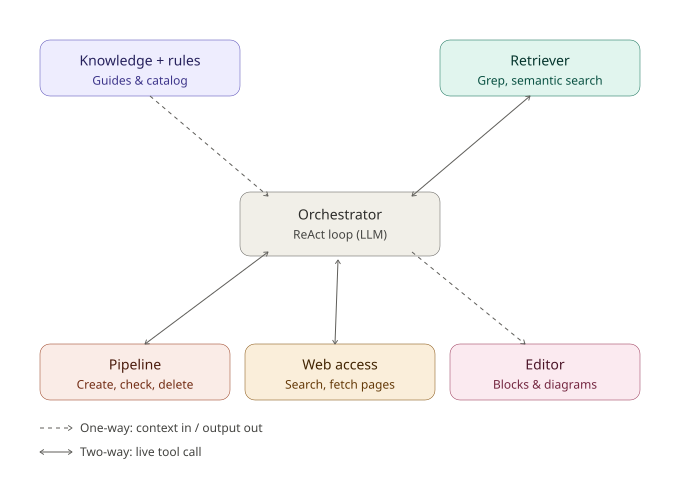

# Charter Ai

A VS Code extension that helps teams design and draft project documents from the open
codebase. Home starts empty — Ask Charter Ai (or New Document) builds the doc set; each
document is a BlockNote canvas with AI chat, templates, and Mermaid diagrams.

## Architecture (runtime)

Two layers, one runtime (Node — the VS Code extension host). There is no separate backend
process to install or bundle.

1. **Webview (React + Vite)** — `src/`: Home, canvas editor, chat panel.
2. **TS extension host** — `extension/`: disk persistence under `.charter-ai/`, ReAct agent
   loop, LLM calls, semantic embeddings, pipeline tools.

The webview talks to the host over `postMessage`. All AI work uses an OpenAI-compatible
provider (DeepSeek by default; Kimi or a local Ollama-style endpoint optional) via the
`openai` npm SDK.

Legacy fixed-pipeline content (old 6-phase defs, field guides, curated charter templates)
is archived under [`reference/legacy-pipeline/`](reference/legacy-pipeline/) for lookup only.

## Proposed architecture — agent and hardening priorities

Charter AI runs on **one ReAct-style agent**, not a multi-agent swarm — the same LLM loop
is reused with two different personas (Home orchestrator vs. canvas drafter) depending on
context. Everything below is organized around the six nodes this agent talks to.



- **Dashed arrows** — one-way. Static context going in (rules, field guides) or a final
  artifact going out (drafted document). Not a live back-and-forth.
- **Solid arrows** — two-way. A real tool call: the orchestrator asks, the module responds,
  and the result feeds back into the loop.

### The nodes

| Node | Role | Link type |
|------|------|-----------|
| **Knowledge + rules** | Field guides and block catalog — per-doc-type drafting guidance and BlockNote block shapes | One-way in |
| **Retriever** | `semantic_search`, `grep`, `read_file` over the workspace, seeded by embeddings sync | Two-way |
| **Orchestrator** | The ReAct loop itself — up to 8 tool turns, JSON-mode parsing, never both `tool` and `document` in one turn | Hub |
| **Pipeline** | `list_pipeline` / `generate_pipeline` / `remove_pipeline_docs` — manages Home doc slots | Two-way |
| **Web access** | Not yet built — a proposed search/fetch tool for external context | Two-way (planned) |
| **Editor** | Where the final `document` block array lands — normalized, Mermaid-validated, saved to `.charter-ai/` | One-way out |

### Priority order for hardening

The order follows a dependency chain: earlier items cap the quality of everything after them.

1. **Retriever grounding quality**  
   Everything downstream is bounded by this. If `semantic_search` and `grep` aren't reliably
   surfacing the right files, no amount of prompt tuning fixes doc quality — the model just
   writes confident-sounding fiction. Get embedding sync solid and retrieval precision high
   before touching anything else.

2. **Knowledgebase and field guides**  
   Sharpen the per-doc-type templates (System Design, Charter info, Tech Docs) so they force
   completeness the way arc42 or C4 would. A better template is one of the cheapest levers
   for depth — it stops the model from skating past sections it would otherwise summarize
   vaguely. (Starter material lives in `reference/legacy-pipeline/`.)

3. **Orchestrator loop behavior**  
   This is where clarify-before-drafting logic and multi-doc decomposition (shared
   investigation, sequential drafting loops) live. Context trimming matters most here — as
   usage scales from 1 doc to many, stale observations piling up in the message history is
   what breaks the loop, not the model's reasoning.

4. **Editor self-verification pass**  
   Mermaid correctness is already hard-gated. Extend that same instinct to prose: after a
   section drafts, have the loop re-check its claims against the files it cited. This is the
   highest-leverage way to kill hallucinated details before they hit `.charter-ai/`.

5. **Pipeline sequencing and UX**  
   Mechanically already solid (create/check/delete). What's left is UX around multi-doc
   runs — streaming `loadCanvas` / `loadDocTypes` progress per document as they finish, so a
   multi-doc request doesn't look like a stalled spinner.

6. **Web access**  
   Build this last. It isn't implemented yet, and an unscoped fetch tool is the easiest way
   to blow the context budget or pull in low-quality pages mid-draft. Needs the same
   truncation discipline as the other tools plus a domain allowlist before it's safe to wire
   into the loop.

## Getting started

```bash
npm install
npm run build
```

Then open this folder in VS Code, press `F5` to launch the Extension Development Host, and run
**"Charter Ai: Open Pipeline"** from the command palette.

## Configuring the AI key

Provide an OpenAI-compatible API key either way:

- **SecretStorage (recommended):** run **"Charter Ai: Configure API Key"** from the command palette.
- **Environment variable:** `export DEEPSEEK_API_KEY="sk-..."` (or `MOONSHOT_API_KEY` for Kimi)
  before launching VS Code.

Select the active provider/model in `.charter-ai/config.json`:

```json
{ "llm": { "provider": "deepseek", "model": null } }
```

Optional embeddings (for `semantic_search`) via **"Charter Ai: Configure Embeddings"** or
`"embeddings"` in the same config (Ollama + `nomic-embed-text` by default).

## Scripts

| Command | What it does |
|---------|--------------|
| `npm run build` | Build extension bundle + webview |
| `npm run build:extension` | esbuild → `out/extension.cjs` |
| `npm run build:webview` | vite → `dist/` |
| `npm run dev` | Vite dev server (webview only) |
| `npm run lint` | ESLint over the project |

## Contributing

See [`CONTRIBUTING.md`](CONTRIBUTING.md) for the layer playbook and conventions.
