# CharterAI Agent — Reverse-Engineered Architecture Analysis

> **Method note.** Every conclusion in this report is derived from the actual source code in this repository (`extension/**`, `extension/agent-worker/**`, `shared/**`, `src/**`). Evidence is cited as `file:line` with function/class names. The design document `CharterAI_Agent_Implementation_Plan.md` is referenced only to explain comments that cite it (e.g. "plan §7"); it is never used as evidence. `Archive.zip` and the compiled bundles under `out/` are ignored. Where the code is silent on a question, the report says so explicitly instead of inferring.

---

## 1. Executive Summary

CharterAI is a **read-only, evidence-grounded repository-analysis agent** embedded in a VS Code extension. It does not write code, run a terminal, or use git. Its product is **analysis findings** and **generated project documents** (Charter/PRD/System Design/Dev/QA), persisted as editable BlockNote canvases in `.charter-ai/`.

The system is a three-layer runtime inside one Node process (the VS Code extension host):

1. **Webview** (`src/`) — React 19 UI. Pure message client: zero network or LLM calls; every action is a `postMessage` to the host.
2. **Extension host** (`extension/extension.ts`) — brokers VS Code APIs: repository tools (fs + ripgrep + LSP + dependency parsing), revision-safe document service, SecretStorage credentials, durable state, and the webview IPC.
3. **Isolated agent worker** (`extension/agent-worker/worker.ts`) — a `node:worker_threads` process running the actual agent: an `AgentRuntime` task lifecycle manager whose `TaskRunner` is `orchestratorRunner`, the deterministic orchestrator that routes requests between a bounded tool loop and an LLM-planned task-graph pipeline.

**Decision architecture in one sentence:** the agent is *primarily LLM-reasoning-driven inside a deterministic orchestration shell*. Deterministic code owns the skeleton — routing, planning fallback, task graph, scheduling, budgets, retries, loop detection, evidence grounding, validation gates, rollout flags, state persistence. The LLM owns the content — tool selection, what to read, findings, follow-up questions, document text, claim judging, and the final answer.

**Headline mechanics:**

| Concern | Actual implementation |
|---|---|
| Routing | Deterministic regexes + 240-char threshold (`ComplexityRouter.ts:17-44`); a dormant classifier hook exists |
| Simple path | Bounded tool loop: ≤4 LLM passes, ≤12 tool calls, loop detection, forced tool-free synthesis (`toolLoopTaskRunner.ts:334-441`) |
| Complex path | Planner (optional temp-0 LLM JSON plan, deterministic playbook fallback) → DAG (`TaskGraphStore`) → semaphore scheduler → typed workers → validation → synthesis |
| LLM | Raw `fetch` + manual SSE to DeepSeek `/chat/completions` (OpenAI-compatible), native function calling, no SDK |
| Tools | 18 implemented read-only tools (fs / ripgrep / LSP / dependency); 3 contract names never implemented (git diff/history/index status) |
| Memory | Durable per-workspace JSON (`agent-state/*.json`, atomic writes): task graph + outputs, evidence, findings/facts, document IRs, session; SHA-256 repo fingerprint gates resume |
| Validation | Deterministic evidence-staleness + coverage checks **and** an LLM-as-judge claim pass with targeted section regeneration |
| Failure | 2 node retries (exponential backoff + jitter), 2 stream retries (pre-output only), 1 context-overflow rebuild, transitive DAG blocking, fail-closed rollout flags |
| Concurrency | Worklist scheduler, per-worker-type semaphores (2/2/2/2), adaptive 429 backpressure, one foreground task per session |

**Biggest strengths:** the evidence-grounding invariants (every `observed` claim must cite evidence IDs the model actually read; uncited claims are downgraded, never silently trusted), revision-safe documents (user edits always win; conflicts park agent drafts), content-free diagnostics, and crash-recovery via fingerprint-gated resume.

**Biggest bottlenecks:** single foreground task per session; no semantic retrieval (lexical ripgrep + LSP only; `semanticRetrieval` flag is `false`); naive `chars/4` token estimation; LLM file summaries are NoOp in production; the worker's knowledge stores are in-memory and snapshotted wholesale.

---

## 2. Complete Architecture

The diagram below reflects the actual call graph. Nodes marked **(D)** are hard-coded/deterministic; **(LLM)** are model-driven decisions; **(B)** are both (a deterministic harness around LLM content).

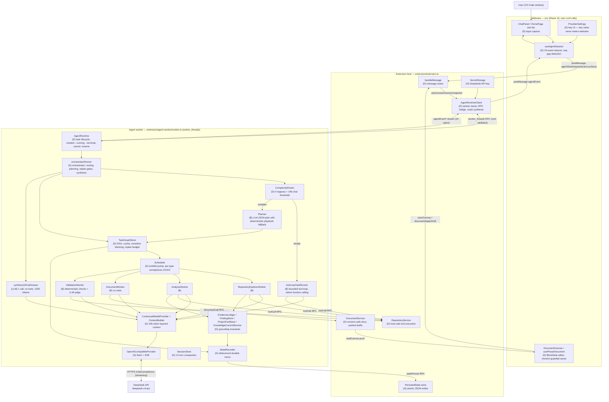

**Key architectural facts:**

- **One process, three trust domains.** The webview never touches credentials or model APIs (`ProviderSettings.tsx` invariant: "credentials never enter webview state"); the worker never touches VS Code APIs (repository tools execute host-side through typed RPC, `extension.ts:147-154`); the host never runs model logic (it only brokers).
- **The worker is the agent.** `extension.ts:82-85`: "orchestration runs in an isolated worker thread (`out/agent-worker.cjs`). The host only brokers VS Code APIs + webview messages." Provider credentials pass in `workerData` (runtime memory only, never the webview).
- **Every cross-boundary message is schema-validated** (zod): webview↔host (`extension/protocol.ts`), host↔worker (`workerProtocol.ts:41-91` — "every message is untrusted until parsed"), and tool results both directions (`toolResultEnvelopeSchema`, `worker.ts:150-156`, `AgentRuntimeClient.ts:228-235`).
- **Read-only is enforced by absence**, not by a filter: "No write, shell, patch, or delete tool exists" (`ToolDefinition.ts:3-6`); the gateway header repeats "no write/shell tool can exist here" (`RepositoryToolGateway.ts:16-18`).

---

## 3. Actual User Request → Final Response Flow

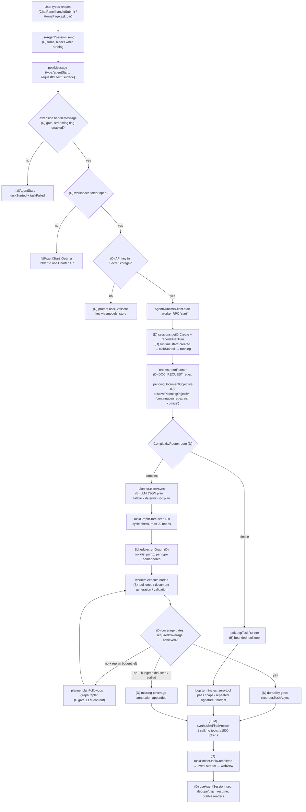

Branching conditions that actually exist in code (all **deterministic**, none keyword-inspected by the LLM):

1. **Does the LLM decide which tool to call?** Yes — inside a worker node, tool choice is native OpenAI function calling (`OpenAICompatibleProvider` SSE `tool_calls` deltas; `toolLoopTaskRunner.runPass:135-152`). But the *set of tools available* is narrowed deterministically per node (`WorkerSpec.allowedTools`, e.g. validation nodes get only 4 search/read tools, `Planner.ts:311`; document nodes get none).
2. **Does code inspect keywords first?** Yes — before any LLM call: `DOC_REQUEST`/`hasDocumentIntent` regex (`DocumentIntent.ts:2-3`), `CONTINUATION_REQUEST` (typo-tolerant "cotniue", `OrchestratorRunner.ts:128-129`), and `ComplexityRouter` regexes (`ComplexityRouter.ts:19-28`). These decide the *path*, not the work.
3. **Are tools selected through explicit conditions?** Only in the sense of per-node `allowedTools` filters and the rollout `filterModelTools` (`FeatureFlags.ts:93-99`). There is no if/else per tool.
4. **Is there a router?** Yes — `ComplexityRouter` (deterministic) and feature-flag fallback: when `taskGraph && subagents` are both disabled the router is replaced with `classify: () => 'simple'` (`worker.ts:400-402`).
5. **Is there an agent loop?** Yes — `runToolLoop` (`toolLoopTaskRunner.ts:334-441`), bounded.
6. **Can the LLM call tools repeatedly?** Yes, up to `maxIterations` (4) passes and `maxToolCalls` (12) per task, minus budget reservations.
7. **What terminates the loop?** A pass with zero tool calls (`:342-345`); iteration cap (`:339`); tool-call cap (`:376`); identical tool-call signature repeated ≥2 (`:348-362`); model/tool budget exhaustion → synthetic empty pass → forced synthesis (`:299-311`); abort signal (`:341`).
8. **What happens when a tool fails?** Result becomes a `role:'tool'` message `"Tool error: …"` (`:405`); the model sees it in the next pass; no automatic retry of the tool itself (retries exist only at provider-stream and node levels).
9. **What happens on invalid model output?** Tool arguments that fail `JSON.parse` are passed as `{raw: trimmed}` so the gateway rejects them safely (`:199-208`); malformed SSE → `ProviderError('invalid_response')` (non-retryable); workers' fenced-JSON outputs get one repair retry, then a deterministic fallback (see §11).
10. **Is there retry/recovery?** Yes — narrow and explicit: 2 stream retries (only before any output, only retryable kinds, `:169-175`); 2 node retries with exponential backoff + jitter and `Retry-After` honoring (`OrchestratorRunner.ts:270-304`); one context-overflow rebuild (`:427-436`); crash recovery via durable state (§10).
11. **Is there a max iteration/token limit?** Iterations: yes. Tokens: `TaskBudgetController` reserves `maxInputTokens`/`maxOutputTokens` per task before each call and degrades to evidence-only synthesis on exhaustion (`TaskControls.ts:34-52`).

---

## 4. Keyword / Rule-Based vs LLM Reasoning

### A. Keyword / Rule-Based Decisions (deterministic inventory)

| What is detected | Where | What it triggers | Optimization or control? |
|---|---|---|---|
| Document intent — verbs `create/generate/write/produce/draft/build/prepare/need/want/require` within 100 chars of `documents?/docs?/documentation/prd/spec(ification)?` | `DocumentIntent.ts:2-3`, `hasDocumentIntent()` | Routes request to the complex document pipeline; remembered as `pendingDocumentObjective` for follow-ups (`OrchestratorRunner.ts:202`) | **Control** — changes the entire execution path |
| Multi-document asks ("generate three documents") | `ComplexityRouter.ts:23-24` `MULTI_DOC` | `'complex'` route | Control |
| Multi-part asks ("…and also analyze…") | `ComplexityRouter.ts:27-28` `MULTI_SENTENCE` | `'complex'` route | Control |
| 19 complexity keywords (`analy[sz]e`, `audit`, `architecture`, `security`, `migration`, …) | `ComplexityRouter.ts:19-20` `COMPLEX_KEYWORDS` | `'complex'` route | Control |
| Length > 240 chars | `ComplexityRouter.ts:17,43` | `'complex'` route | Control |
| Continuation follow-ups (incl. typo `cotniue`) | `OrchestratorRunner.ts:128-129` `CONTINUATION_REQUEST` | Builds a contextual objective from the last 6 conversation turns + `PENDING DELIVERABLE`, re-routed through the router (`:496-515`) | Control |
| Playbook domains — 5 keyword regexes (security, architecture, scalability, technical-debt, migration) | `playbooks.ts:15-71`, matched in `Planner.ts:178-191` | Deterministic plan: one analysis node per coverage area (max 5/domain, 12 total) | Control (fallback), replaces LLM planning when planning fails |
| Document count ("3 docs") | `Planner.ts:50-56` `MULTI_DOC_COUNT`/`WORD_COUNTS`, clamped 1..10 (`:254`) | Reserves node capacity `count*2 + (count>1?1:0)` | Control (fallback plan shape) |
| Required-coverage achieved vs missing | `OrchestratorRunner.ts:310-321`, `ValidationWorker.ts:105-123` | Missing coverage → follow-up replan (budgeted) or annotation; missing doc section + no unknown finding → validation failure | **Control** — gates task completion |
| Zero-coverage streak ≥ 2 | `OrchestratorRunner.ts:328-336` | `stopLoop` — terminates the plan loop | Control (infinite-loop prevention) |
| Replan stall (round added nothing) | `TaskGraphStore.ts:102-103`, `OrchestratorRunner.ts:376-383` | Ends follow-ups | Control |
| Repeated identical tool-call signature ≥ 2 | `toolLoopTaskRunner.ts:348-362` | Forced synthesis break | Control (loop detection) |
| Provider error category | `ProviderError.ts:6-21`, `isRetryableProviderError:41-43` | Retry allowed only for `rate_limited/server/network/timeout` | Control |
| Context-overflow regex `/context\|maximum (?:context )?length\|too many tokens…/i` | `toolLoopTaskRunner.ts:91-94` | One rebuild: drop oldest assistant+tool pair (`:427-436`) | Control (recovery) |
| Observed claim without valid evidence citations | `AnalysisWorker.commit():197-242` | **Downgrade `observed` → `inferred`** + assumption note; unknown evidence IDs ignored | Control (grounding invariant) |
| Evidence staleness: hash changed / file gone / version moved / symbol unresolvable | `ValidationWorker.checkEvidence():186-271` | Stale marks + refresh (re-resolve ranges); findings flagged `needsRevalidation`; never deleted | Control (correctness) |
| Claim kind `current` vs `proposed` | `ValidationWorker.judgeClaims():449-471` | Only contradicted *current* claims trigger section regeneration; proposed conflicts are review flags | Control (semantic policy) |
| Cross-document contradiction vs fact base | `ValidationWorker.ts:522-541` `claimKey` match | Fact base confirms → resolved; else unresolved issue | Control |
| Section JSON parse failures | `DocumentWorker.parseSection():690-727` | 1 retry as plain Markdown; then editable review callout | Control (recovery) |
| User edited document during generation (revision mismatch) | `DocumentService.checkpoint():351-365` | Agent draft **parked**, conflict reported; user edits win | Control (safety) |
| Repo fingerprint changed while interrupted | `worker.ts:362-363,518-522` | Resume **refused**: "Repository changed while the task was interrupted" | Control (safety) |
| Feature flags / rollout stage | `FeatureFlags.ts:64-99`, `extension.ts:100-110` | Fail-closed cascade (`!taskGraph` → disables workers/validation/parallel); tool list filtered before reaching the model | Control (rollout) |
| Session compaction (>12 turns or >12k chars) | `session.ts:178-203` | Keeps last 6 turns; promotes objectives/decisions/evidence/fact IDs to memory | Control (context budget) |
| Worker error kind → friendly UI message | `AgentRuntimeClient.classifyFailure():317-328` (regexes) | Error-kind normalization for diagnostics | Optimization |
| Mermaid/diagram block shapes, heading clamps, block-type allowlists | `sanitizeBlocks.ts:4-50,306`, `DocumentIR.ts:32-94` (zod) | Model output shaped into valid canvas IR; invalid blocks rejected at checkpoint | Control (output contract) |

### B. LLM-Driven Decisions (complete inventory)

| Decision | Where the LLM makes it | How |
|---|---|---|
| Which tool to call, with which arguments | Native function calling; SSE `tool_calls` deltas → `toolLoopTaskRunner.runPass:135-152` | The model emits OpenAI-style tool calls; no code picks tools |
| Which files/symbols to inspect | Same tool calls | Model chooses paths/queries for `search_code`, `read_file`, `find_symbol`, … |
| What information is relevant / whether more retrieval is needed | Implicit in continued tool calls until the model emits a tool-free pass | No explicit "stop" reasoning is surfaced (`thinking:'disabled'`) |
| Analysis findings (claims, types, unknowns, contradictions) | `AnalysisWorker` role prompt → fenced JSON, schema `workerOutputSchema:74-82` | LLM content, then deterministically committed |
| Repository survey highlights + package manifest | `RepositoryExplorerWorker` prompt `:49-67`, `explorerOutputSchema:40-45` | LLM content |
| Whether coverage is missing / what to follow up | `new_questions`, `missing_coverage`, `recommended_followups` fields of worker output (`AnalysisWorker.ts:28-44`) | The model signals gaps; the orchestrator deterministically decides whether to replan |
| The plan (when the optional planner pass is wired) | `Planner.requestStructuredPlan():204-225` — temperature 0, `tools: []`, JSON-only schema | LLM plan; **always** falls back to the deterministic playbook plan on any failure (`:166-171`) |
| Document outline + section content | `DocumentWorker` outline prompt `:303-305`, section prompt `:453-457` — `response_format:'json_object'`, no tools | LLM content grounded in injected facts (`factsSummary`, facts ≤30/findings ≤40) |
| Claim verdicts (`supported/weak/contradicted/unsupported`) | `ValidationWorker` LLM-as-judge prompt `:350-363`, bounded retrieval (2 iterations, 4 tools) | LLM judge over document sections + known facts |
| Cross-document contradictions | `ValidationWorker` compare prompt `:502-509`, no tools | LLM pair-wise contradiction detection, then deterministic fact-base resolution |
| Final user-facing answer | `synthesizeFinalAnswer`, `worker.ts:292-335` — 1 call, no tools, ≤1500 tokens | LLM prose from completed structured results + validation summary |
| Task completeness *judgment* | Not by LLM — by deterministic coverage gates; but the LLM's `coverage_achieved` field feeds those gates (`OrchestratorRunner.ts:310-321`) | Hybrid |
| Recovery strategy | Not by LLM — retries/rebuilds/replan are deterministic code paths | — |

### C. Final Verdict

> **The agent is primarily LLM-reasoning-driven with deterministic orchestration.** The LLM decides *what to do* (tools, content, findings, documents, verdicts), while deterministic code decides *what is allowed, how long, in what order, and whether the result is trustworthy*. There is no autonomous LLM planning loop: the plan graph is code-owned; the LLM fills it and may only extend it through code-validated replan signals. This is not a rule-based system with LLM garnish — tool use, retrieval, and all generated content are genuinely model-driven — but neither is it an LLM-orchestrated agent: routing, scheduling, budgets, grounding, and termination are all hard-coded.

---

## 5. Classify the Agentic Architecture

| Pattern | Present? | Evidence | Why |
|---|---|---|---|
| **ReAct** | **Yes (bounded)** | `toolLoopTaskRunner.runToolLoop:334-441` — reasoning pass → tool calls → observations appended as `tool` messages → next pass | Classic ReAct mechanics via native function calling, but heavily bounded (4 passes/12 tools), with loop detection and a forced tool-free synthesis. No visible chain-of-thought (thinking disabled). |
| **Planner/Executor** | **Yes** | `Planner.planAsync → TaskGraphStore → Scheduler → workers` (`worker.ts:394-446`, `OrchestratorRunner.ts:224-256`) | Plan is a structured DAG with dependencies; executor is the scheduler. However the *default* planner is deterministic playbook matching, not LLM deliberation — the LLM plan is an optional, always-fallible pass. |
| **Plan-and-Execute** | **Partial** | `planFollowups`/`planRegenerations` + `graph.replan` (`Planner.ts:361-454`, `TaskGraphStore.ts:77-104`) | The plan *can* change during execution, but only through code-validated worker signals with a bounded replan budget (3) and stall detection — not free-form re-planning. |
| **Reflection agent** | **Partial** | `ValidationWorker` LLM-as-judge (`:344-398`) + targeted regeneration nodes (`Planner.ts:361-411`) | Output is judged by an LLM and failed sections are regenerated — a reflect-then-revise pipeline. But it is a fixed two-stage pipeline, not iterative verbal self-reflection. |
| **Reflexion** | **No** | — | No verbal self-critique loop, no episodic memory of past failures used to improve future attempts. |
| **Tool-calling agent** | **Yes** | Native function calling, 18 tools, `ToolDefinition.ts` | The simplest accurate label for the simple path and for every worker node. |
| **Router agent** | **Partial** | `ComplexityRouter.ts:39-45` | A deterministic router, not an LLM router. The classifier hook (`classify`, `:40`) is dormant. |
| **Multi-agent system** | **No** | Workers are `workerType`-dispatched executors in one thread (`worker.ts:426-444`) | No agent-to-agent communication; dependencies flow as plain string outputs. The `subagents` feature flag is a naming choice, not separate agents. |
| **Supervisor/Orchestrator agent** | **Partial (deterministic)** | `orchestratorRunner` (`OrchestratorRunner.ts:194-492`) | Orchestration is code, not an LLM supervisor: no delegation messages, no arbitration. |
| **Hierarchical agent** | **No** | — | No nested agent calls; one orchestrator above one worker pool. |
| **Deep Agent** | **No** | — | No self-directed planning beyond replan budget, no file writing, no sub-agent spawning, no goal autonomy. |
| **Workflow/state-machine agent** | **Strong elements** | `AgentTaskHandle` lifecycle (`AgentRuntime.ts:11-33`), node states `queued→running→completed/failed/blocked/cancelled` (`TaskGraphStore.ts`), rollout gate ladder (`GateEvaluator.ts:44-50`) | The complex path is a deterministic state machine with LLM steps inside nodes. |
| **Autonomous coding agent** | **No** | Read-only tools only; no write/shell/git | By explicit design ("the product is a read-only repository agent", `extension.ts:405-406`). |
| **Hybrid architecture** | **Yes** | All of the above | Deterministic orchestration shell + LLM reasoning inside bounded tool loops + LLM-as-judge validation + deterministic grounding. |

### Final Agent Classification

> **A deterministic-orchestrated, evidence-grounded, read-only repository-analysis agent: a hybrid of a bounded ReAct-style tool loop (simple requests) and an LLM-assisted planner/executor DAG pipeline with LLM-as-judge validation and targeted regeneration (complex/document requests), hardened by hard-coded budgets, grounding invariants, and crash-recoverable durable state.**

---

## 6. Agent Loop Analysis

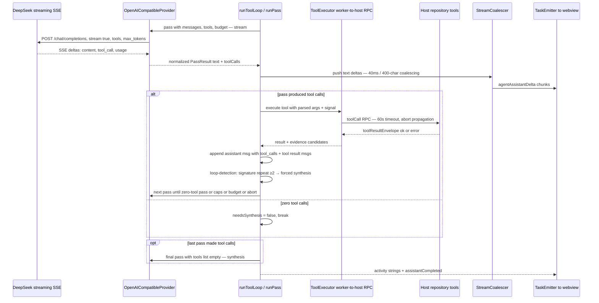

**Is this actually a ReAct loop?** Mechanically yes — within a worker node: the model produces a response pass; if that pass contains tool calls, the results are appended as observations (`role:'tool'` messages, `toolLoopTaskRunner.ts:405-413`) and the model is re-invoked with the augmented history. But it is a *bounded* ReAct: hard caps (4 iterations, 12 tools), repeated-call detection, budget preemption, and a mandated tool-free final synthesis pass (`:417-422`).

**Where does reasoning happen?** Inside the model only. The code deliberately suppresses reasoning visibility: `thinking:'disabled'` in the loop config (`worker.ts:277-285`), planner and document JSON passes; `reasoningContent` is replayed only to preserve multi-turn DeepSeek API compatibility (`OpenAICompatibleProvider.ts:135-146`); the event layer enforces "Never chain-of-thought" (`AgentRuntime.ts:64-66,78`).

**Is reasoning visible or hidden?** Hidden by policy at three levels: provider request, event emission, and diagnostics redaction (prompts/responses have no representable field, `OperationalLogger.ts:1-5`).

**Does the LLM receive tool results?** Yes — every result (or `"Tool error: …"`) is appended verbatim as a tool message; additionally `evidenceCandidates` from results are committed to the `EvidenceLedger` and referenced back to the model as `[EVIDENCE:id]` handles (`toolLoopTaskRunner.ts:389-404,444-449`).

**Can it call multiple tools?** Yes — multiple tool calls per pass (a `Map<string, ModelToolCall>` per pass, `:111`), up to 12 calls and the per-task budget.

**Can it revise its plan?** Not inside the loop (the loop has no plan object). At the task level, yes but only through code: worker signals (`missing_coverage`, `new_questions`, `recommended_followups`, `regenerate-section`) cause `planner.planFollowups`/`planRegenerations` → `graph.replan` (`OrchestratorRunner.ts:340-393`) within a replan budget of 3 (`TaskGraphStore.ts:24`).

**Can it abandon its original plan?** No. The graph grows via replan; nodes are never removed (only failed/blocked/cancelled). Loop-detection `block(id, reason)` skips a node but leaves the graph intact (`TaskGraphStore.ts:141-146`).

**Can it dynamically create new tasks?** New *graph nodes* only via the replan signals above. New *tasks* come only from user messages (`runtime.start`, one foreground task at a time).

**What determines termination?** (a) zero-tool-call pass; (b) iteration cap 4; (c) tool-call cap 12; (d) repeated identical tool-call signature ≥2; (e) budget exhaustion → synthetic empty pass → evidence-only synthesis; (f) abort signal (`:341,374`).

**What prevents infinite loops?** Five independent mechanisms: iteration/tool caps; signature-repeat detection; token budgets reserved *before* each call (`TaskControls.ts:34-46`); zero-coverage streak ≥2 stopping the whole plan loop (`OrchestratorRunner.ts:328-336`); replan budget + stall detection at graph level (`TaskGraphStore.ts:102-103`).

---

## 7. Planning Architecture

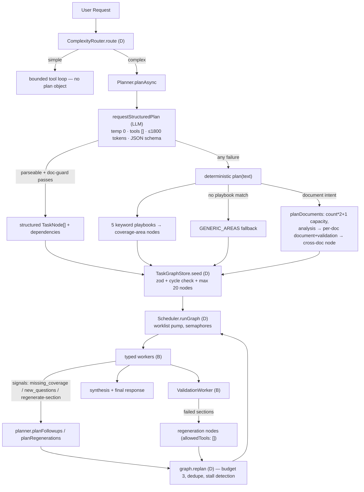

**Is there an explicit planning phase?** Yes for complex requests only: `emit.activity('Planning analysis tasks')` → `planner.planAsync` (`OrchestratorRunner.ts:224-256`). Simple requests skip planning entirely.

**Is the plan generated by the LLM?** Optionally. The default is deterministic: playbook keyword → coverage areas. The LLM path (`Planner.ts:204-225`) is guarded — a document request whose structured plan lacks a `document` node falls back to `planDocuments` (`:166`), and any failure falls back to `plan(text)` (`:171`).

**Is the plan deterministic?** The *shape* is: every plan is a DAG of `TaskNode`s with `dependencies`, zod-validated, cycle-checked (`contracts/TaskGraph.ts:64-101`). The *content* (titles, objectives, questions) can be LLM-generated.

**Is the plan structured data?** Yes — `TaskNode { id, title, workerType, objective, questions, requiredCoverage, allowedTools, dependencies, budget, … }` (`contracts/TaskGraph.ts:17-36`), persisted into durable state (`PersistedState.ts:52`).

**Can the plan change during execution?** Yes, additively and only via code: replan budget 3, node cap 20 (store default) / 40 (worker wiring), dedupe by normalized title, stall terminates follow-ups.

**Are tasks/dependencies explicitly represented?** Yes — dependency edges (`dependencies: string[]`); dependents run only after all dependencies are `completed` (`readyNodes`, `contracts/TaskGraph.ts:104-110`); failure transitively blocks dependents (`TaskGraphStore.ts:149-171`).

**Can tasks run in parallel?** Yes — scheduler-level, per worker type (2/2/2/2), capped by the task's `maxParallelWorkers` (min across nodes, `OrchestratorRunner.ts:141-151,417-431`).

**Is there a scheduler?** Yes — `Scheduler.runGraph`, a worklist pump re-invoking `readyIds()` after every settle (`Scheduler.ts:59-93`).

**Are tasks delegated to sub-agents?** No. Nodes are dispatched to in-thread worker functions by `workerType` (`worker.ts:426-444`): `repository` → `RepositoryExplorerWorker`, `analysis` → `AnalysisWorker`, `document` → `DocumentWorker`, `validation` → `ValidationWorker`. They share one model provider, one knowledge layer, one event stream.

**Does execution strictly follow the plan?** Yes, modulo replan additions. The executor cannot reorder or skip nodes on its own; the orchestrator's deterministic gates (coverage, durability flush before dependents, `OrchestratorRunner.ts:412`) are the only controllers.

---

## 8. Codebase Understanding / Retrieval Architecture

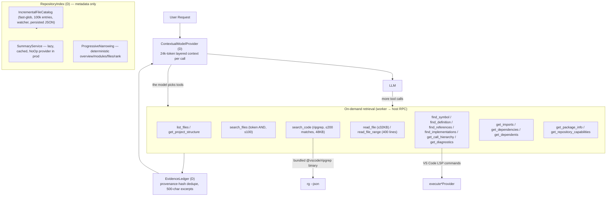

**How it discovers relevant files:** entirely model-driven tool selection over a deterministic catalog. There is no automatic relevance scoring feeding the prompt — the model asks via `list_files`, `search_files`, `search_code`, `get_project_structure`, then narrows with `read_file`/`read_file_range`.

**Symbol search:** yes, via VS Code LSP commands wrapped by `VscodeLspBridge` (`LspBridge.ts:118-310`) — workspace symbols, definitions, references, implementations, document symbols, diagnostics, call hierarchy. Supported languages are the bundled TS/JS + web set only (`LSP_LANGUAGES`, `lspTools.ts:344-354`); failures degrade to `{available:false}` instead of erroring (`lspTools.ts:49-59`).

**Grep/ripgrep:** yes — `search_code` spawns the bundled `@vscode/ripgrep` binary with `--json`, exclusions (`.git`, `node_modules`, credential globs), streaming parse, caps (200 matches / 200-char lines / 48KB), exit-code-2 → invalid-pattern error (`RipgrepSearch.ts:52-145`).

**Index:** yes, but metadata-only — `RepositoryIndex` persists path/kind/size/extension/language/flags (+ lazy SHA-256 content hashes) under `<storageUri>/repository-index/<workspaceId>.json` with atomic writes and a 300ms-debounced file watcher (`IncrementalFileCatalog.ts:198-241`). **No source content is indexed.**

**Embeddings/vector search:** **No.** `semanticRetrieval: false` in `FULL_FEATURE_FLAGS` ("remains future work", `FeatureFlags.ts:38-48`).

**LSP:** yes (above). **AST parsing:** **No** — dependency extraction is lexical regex adapters (`typescriptAdapter/pythonAdapter/goAdapter`, `DependencyAdapters.ts:52-165`); multi-line TS imports are a documented limitation (`DependencyAdapters.test.ts:43-46`).

**How it avoids loading the whole repository:** never reads wholesale. Caps at every layer: 32KB whole-file, 400-line ranges, 200-match searches, 500-file listings, 64KB gateway budget with progressive string-halving truncation (`OutputLimiter.ts:47-71`), 100k-entry index.

**How context is prioritized:** fixed quota-allocated layers — system → objective → role/task state → instructions → findings → evidence excerpts → conversation → tool results (`ContextBuilder.ts:9-26,70-77`). The first layer that doesn't fit is char-truncated with `[truncated]`; later layers are dropped. Slices: ≤30 facts, ≤40 findings, ≤20 evidence excerpts, ≤6 conversation turns, ≤6k prior-session summary (`ContextualModelProvider.ts:26-67`).

**How large files are handled:** refusal signal — `read_file` returns `tooLarge` instead of content (`tools.ts:260`); the model is expected to switch to ranges. Dependency adapters read only the first 400 lines with a warning (`dependencyTools.ts:51-62`).

**How token limits are handled:** three layers — (1) per-call context budget 24k tokens (chars/4 estimate, `ContextBuilder.ts:34-37`); (2) per-task `TaskBudgetController` reserving input+output before each call and settling actual usage after (`TaskControls.ts:34-52`); (3) provider `max_tokens` per request (`OpenAICompatibleProvider.ts:171`). No real tokenizer anywhere — `chars/4` is the approximation.

**File summaries:** the infrastructure exists (`SummaryService` with memory LRU 500 + disk cache keyed by content hash), but production wires `NoOpSummaryProvider`, so summaries are heuristic stubs (`summary: (no model provider) ${content.slice(0,200)}…`, `SummaryService.ts:62-89`) — `extension.ts:256-268` never passes a model provider.

**Working memory:** yes, per-task in the worker: evidence ledger, finding store, fact base, session store (all snapshotted to durable state, §10). The tool loop itself carries the full message history up to budget.

---

## 9. Tool Architecture

```mermaid
flowchart LR
    subgraph WORKER["Worker (decides nothing about tools — the model does)"]
        MOD["LLM (native function calling)"]
        TLP["toolLoopTaskRunner"]
    end
    subgraph HOST["Extension host — RepositoryToolGateway (D)"]
        G["executeTool(name, input, signal)<br/>zod input validation"]
        PP["PathGuard (lexical + symlink containment)"]
        SP["SensitiveFilePolicy (block paths + redact secrets)"]
        OL["OutputLimiter (64KB budget)"]
        TO["30s timeout · toolResultEnvelope"]
    end
    MOD -->|"tool_call (selected by model)"| TLP
    TLP -->|"toolCall RPC"| G
    G --> PP --> SP --> OL --> TO
    subgraph IMPL["Implementations"]
        FS["tools.ts — list_files, search_files, search_code, read_file, read_file_range, get_project_structure, get_package_info"]
        LSP["lspTools.ts — find_symbol, find_definition, find_references, find_implementations, get_document_symbols*, get_diagnostics, get_call_hierarchy, get_repository_capabilities"]
        DEP["dependencyTools.ts — get_imports, get_dependencies, get_dependents"]
    end
    TO --> IMPL
```

*\* `get_document_symbols` is implemented in `lspTools.ts:213` but absent from the `RepositoryToolName` contract union (`ToolDefinition.ts:8-28`) — a contract/implementation mismatch.*

| Tool | Purpose | Input → Output | Who decides | Deterministic or LLM-selected | Result → LLM? | Mutates state? |
|---|---|---|---|---|---|---|
| `list_files` | Directory metadata, paginated | `path, pattern, limit≤500, cursor` → entries + `nextCursor` | LLM | LLM-selected | Yes (JSON + evidence) | Evidence ledger |
| `search_files` | Name search (every token must match) | `query, limit≤100` → matches | LLM | LLM-selected | Yes | Evidence ledger |
| `search_code` | Regex ripgrep | `pattern, path, limit≤500, offset` → matches + `nextCursor, refineHint` | LLM | LLM-selected | Yes | Evidence ledger |
| `read_file` | Whole file ≤32KB | `path` → content or `tooLarge/binary` | LLM | LLM-selected | Yes | Evidence ledger |
| `read_file_range` | Numbered line range | `path, startLine, endLine` → lines | LLM | LLM-selected | Yes | Evidence ledger |
| `get_project_structure` | Package topology tree | `{}` → roots with children/flags | LLM | LLM-selected | Yes | Evidence ledger |
| `get_package_info` | Nearest manifest parse | `path?` → npm/go/python manifest data | LLM | LLM-selected | Yes | Evidence ledger |
| `find_symbol` | Workspace symbols | `query, limit≤200` → symbols | LLM | LLM-selected | Yes (`available:false` degrades) | Evidence ledger |
| `find_definition` | Definitions at line:col | `path, line, column` → locations | LLM | LLM-selected | Yes | Evidence ledger |
| `find_references` | References | same | LLM | LLM-selected | Yes | Evidence ledger |
| `find_implementations` | Implementations | same | LLM | LLM-selected | Yes | Evidence ledger |
| `get_document_symbols` | File symbol outline | `path` → symbols ≤500 | LLM | LLM-selected | Yes | Evidence ledger |
| `get_diagnostics` | Editor diagnostics | `path` → diagnostics ≤200 | LLM | LLM-selected | Yes | Evidence ledger |
| `get_call_hierarchy` | Incoming/outgoing calls | `path, line` → incoming/outgoing | LLM | LLM-selected | Yes | Evidence ledger |
| `get_repository_capabilities` | Per-language capability matrix | `{}` → language flags | LLM | LLM-selected | Yes | No |
| `get_imports` | Imports with provenance | `path` → imports | LLM | LLM-selected | Yes | Evidence ledger |
| `get_dependencies` | Local/external/manifest deps | `path` → deps ≤100 each | LLM | LLM-selected | Yes | Evidence ledger |
| `get_dependents` | Reverse lexical lookup | `path, limit≤500` → dependents + honesty hint | LLM | LLM-selected | Yes | No |
| `get_git_diff` / `get_git_history` / `get_index_status` | — | Declared in contract only | — | **Never callable — no implementation exists** | — | — |

**Categorization:**

- **File system:** `list_files`, `search_files`, `read_file`, `read_file_range`, `get_project_structure`
- **Search:** `search_code` (ripgrep)
- **Code intelligence/LSP:** `find_symbol`, `find_definition`, `find_references`, `find_implementations`, `get_document_symbols`, `get_diagnostics`, `get_call_hierarchy`, `get_repository_capabilities`
- **Dependency:** `get_imports`, `get_dependencies`, `get_dependents`, `get_package_info`
- **Terminal/shell:** **none** (only `spawn(rgPath)` with no shell, `RipgrepSearch.ts:77`)
- **Git:** **none**
- **Build/test:** **none** (no test execution exists in the agent; "test execution" flows in §15 document this absence)
- **Web:** **none**
- **Memory/Planning/Task-management tools:** **none** — memory and planning are code-internal, not exposed as tools

**Invocation model:** every tool call originates from a model `tool_call` inside a worker tool loop. Deterministic code only: validates input (zod), checks paths (PathGuard), blocks/redacts sensitive content (SensitiveFilePolicy + `redactSecrets` `sk-`/`AKIA`/`ghp_` patterns, `SensitiveFilePolicy.ts:46-51`), caps output (64KB), enforces timeout (30s gateway / 60s RPC), and aborts on cancel (`toolCancel` → host AbortController, `AgentRuntimeClient.ts:147-151`).

**State mutation:** tool results do not directly mutate agent state — `evidenceCandidates` are committed to the `EvidenceLedger` by the loop (`toolLoopTaskRunner.ts:389-404`), and workers commit findings/facts through `KnowledgeCommitService` (the sole write boundary, `KnowledgeCommitService.ts:19-28`).

**Feature-flag filtering:** `filterModelTools` removes all tools when `repositoryTools` is off, and the LSP set (`find_symbol`, `find_definition`, `find_references`, `get_imports`, `get_dependencies`, `get_dependents`) when `lsp` is off — *before* definitions reach a model prompt (`FeatureFlags.ts:93-99`, `extension.ts:139`). Note: `get_document_symbols`, `get_diagnostics`, `get_call_hierarchy`, `get_repository_capabilities` are **not** in the LSP filter set — an inconsistency worth flagging.

---

## 10. State & Memory Architecture

| State kind | Held where | Survives… |
|---|---|---|
| Conversation turns | `SessionStore` (worker memory) + durable `session` field | Task ✓ · Conversation ✓ · Session (restart) ✓ · Workspace switch ✗ (wiped, `StateRecorder.ts:93-101`) |
| Task lifecycle (`created→running→…`) | `AgentRuntime` maps + durable `tasks[]` | Task ✓ · Restart ✓ (rehydrates `running`→`interrupted`) |
| Task graph + node outputs | `TaskGraphStore` (memory) + durable `task.graph` | Task ✓ · Restart ✓ — resume re-queues running nodes, re-seeds completed outputs, never re-runs them (`OrchestratorRunner.ts:237-249`) |
| Evidence ledger | Worker memory + durable `evidence[]` (cap 300; cited evidence exempt) | Task ✓ · Restart ✓ · Workspace ✗ |
| Findings / facts | `FindingStore` / `ProjectFactBase` + durable | Task ✓ · Restart ✓ (restored, `worker.ts:511-515`) |
| Document IRs | Host `DocumentService.lastAgentIRs` + durable `documentIRs` | Restart ✓ — "regeneration base after a restart" (`PersistedState.ts:64`); restored via `restoreAgentIR` (`extension.ts:206-208`) |
| Document revisions + parked drafts | Host `DocumentService` → `.charter-ai/doc-revisions.json`, `pending-drafts.json` | Restart ✓ (side files, atomic writes) |
| Session plan view / documents progress | `AgentTaskHandle` + durable snapshot | Restart ✓ (mirrored into snapshots) |
| Webview UI state | `useAgentSession` reducer + localStorage (workspace-scoped keys) | Webview reload ✓ via `agentLoadSession` → snapshot; seq-gap → `agentResume` |
| Repository index | `<storageUri>/repository-index/*.json` | Restart ✓ (versioned, reconciled by full scan) |
| File summaries | memory LRU 500 + `<storageUri>/summaries/**` | Restart ✓ (content-hash keyed) |
| Provider key | VS Code SecretStorage | Only in SecretStorage — never webview, never state files |

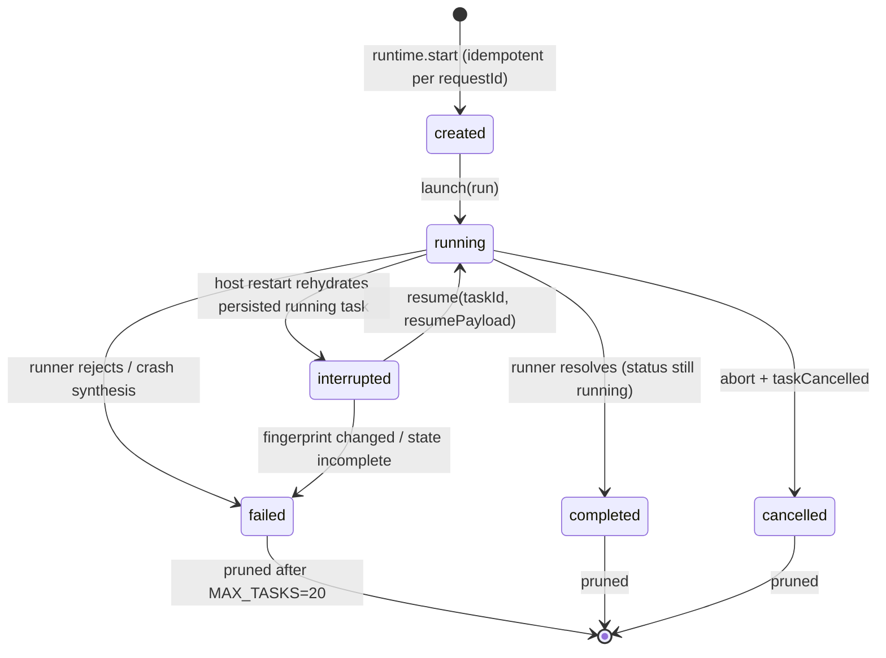

**Within one LLM call:** the full message list (system, objective, findings/facts/evidence excerpts, conversation turns, prior tool messages) assembled fresh by `ContextualModelProvider` per call — nothing is cached between calls except the knowledge stores.

**Within the loop:** `messages` array grows (assistant + tool messages), the evidence ledger accrues candidates, budgets decrement.

**Within a task:** graph nodes, outputs, findings, facts, evidence, session turns, document IRs.

**Between tasks/conversations (same workspace):** knowledge + session survive in durable state; the task graph is per-task but the *last 8 tasks* are persisted (`MAX_PERSISTED_TASKS = 8`, `PersistedState.ts:126`).

**Between sessions/restarts:** everything above via `agent-state/<workspaceId>.json` — atomic temp+rename writes (`PersistedState.ts:150-156`), schema-validated on load, corrupt file → fresh start (`:137-148`); resume gated by SHA-256 repo fingerprint (git HEAD + diff + untracked, or metadata signature for non-git roots, `:215-309`).

**Persistence cadence:** debounced 500ms mirror via `StateRecorder`; immediate flush on terminal events (`:132-144`); `flushAsync()` as a durability gate *before* dependents start (`worker.ts:424`, `OrchestratorRunner.ts:412`) — a completed node's outputs are on disk before anything consumes them.

**No rollback/undo:** semantics are interrupt/resume only — "there is no rollback" is the design (`StateRecorder.ts`), and the only safe-resume check is the fingerprint.

---

## 11. Error Handling & Recovery

```mermaid
flowchart TD
    subgraph F1["LLM call fails"]
        A1["ProviderError kind (auth/rate_limited/server/network/timeout/cancelled/invalid_response/unknown)"]
        A2{"isRetryableProviderError?"}
        A2 -->|yes, before any output| A3["≤2 stream retries, backoff 500·2^n + jitter ≤250ms, Retry-After ≤60s"]
        A2 -->|no / after output| A4["propagate → node-level retry"]
        A4 --> A5{"node attempt < maxNodeRetries=2?"}
        A5 -->|yes| A6["retry node with backoff; 429 → AdaptiveConcurrency halves concurrency"]
        A5 -->|no| A7["graph.fail(id) → transitive dependent blocking"]
        A7 --> A8["task continues with remaining nodes → partial completion reported"]
    end
    subgraph F2["Tool call fails"]
        B1["executor returns {ok:false,error} → appended as 'Tool error: …' message"]
        B2["model sees failure in next pass — no auto tool retry"]
    end
    subgraph F3["Malformed tool arguments"]
        C1["JSON.parse fails → passed as {raw} so gateway zod rejects safely"]
    end
    subgraph F4["Context exceeds limits"]
        D1["overflow regex → ONE rebuild (drop oldest assistant+tool pair)"]
        D2["budget exhaustion → synthetic empty pass → evidence-only synthesis"]
    end
    subgraph F5["Malformed structured output"]
        E1["workers' fenced JSON → extractJsonBlock (fence then brace regex)"]
        E2["one JSON repair retry (tools [])"]
        E3["still bad → deterministic fallback (review callout / validation gap / empty findings)"]
    end
    subgraph F6["Worker crash / host restart"]
        G1["AgentRuntimeClient synthesizes taskFailed with valid seq"]
        G2["durable state rehydrates; fingerprint match → interrupted → resume"]
        G3["fingerprint mismatch → failInterrupted, resume refused"]
    end
```

Per failure mode:

| Failure | Actual recovery path | Code |
|---|---|---|
| LLM call fails (transient) | ≤2 stream retries *only if* retryable kind **and** no text/tool output yet; partial output is preserved, never retried | `toolLoopTaskRunner.ts:115,169-175`; test `:300-318` |
| LLM call fails (hard) | Node retry ≤2 with `500*2^attempt + rand*250` backoff; `ProviderError.retryAfterMs` overrides; gives up on non-retryable kinds/abort | `OrchestratorRunner.ts:270-304`; `ProviderError.ts:16-21` |
| Rate limit (429) | Node retry + `adaptiveConcurrency.reportRateLimit` halves concurrent starts with cooldown, recovers +1 after cooldown | `TaskControls.ts:125-149`, `OrchestratorRunner.ts:290-293` |
| Tool call fails | Failure string appended as a tool message; the model decides next step; tool itself is never auto-retried | `toolLoopTaskRunner.ts:405` |
| Malformed tool arguments | Not retried — `parseToolArguments` falls back to `{raw}`; gateway zod validation rejects with a structured error the model sees | `toolLoopTaskRunner.ts:199-208`; `worker.ts:150-156` |
| Tool returns unexpected output | Envelope validated both sides; invalid → `{ok:false}` treated as tool error | `worker.ts:150-156`, `AgentRuntimeClient.ts:228-235` |
| Tool times out | RPC 60s → `'Tool call timed out.'`; gateway 30s | `worker.ts:66,131-133`; `RepositoryToolGateway.ts:36-37` |
| Context exceeds limits | One rebuild dropping the oldest assistant+tool pair; on repeat → ProviderError | `toolLoopTaskRunner.ts:91-94,427-436` |
| Output truncated | Explicit `truncated` flags + `refineHint` returned to the model; 64KB gateway budget halves largest strings ≤8 rounds | `tools.ts:245-249`, `OutputLimiter.ts:59-71` |
| Document section JSON invalid | One retry as plain Markdown; second failure → editable "Section needs review" callout (never a task failure) | `DocumentWorker.ts:690-760` |
| Document checkpoint conflicts (user edited) | Draft **parked** + `pendingDraftId` surfaced; user applies or discards; agent never overwrites | `DocumentService.ts:351-365`; `DocumentWorker.ts:492` |
| Validation finds contradicted sections | `regenerate-section` signals → targeted regeneration nodes depending on the validator | `ValidationWorker.ts:168-175`, `Planner.ts:361-411` |
| Validation JSON unparseable | One repair pass; then "validation gap" caveat — never silent | `ValidationWorker.ts:372-398` |
| Node fails | `graph.fail` → transitive dependents blocked; siblings continue; partial completion reported ("N of M analysis parts completed") | `TaskGraphStore.ts:149-171`, `OrchestratorRunner.ts:440-450` |
| Replan exhausts budget / stalls | Follow-ups end; missing coverage annotated into the synthesis input | `TaskGraphStore.ts:102-103`, `OrchestratorRunner.ts:376-407` |
| Worker thread crashes | Host synthesizes `taskFailed` for the pending/running task with valid seqs; user can restart | `AgentRuntimeClient.ts:264-298` |
| Extension host restarts mid-task | Rehydrate as `interrupted` → paused event → auto-resume from first incomplete node if fingerprint matches | `worker.ts:511-528`, `AgentRuntime.ts:313-350` |
| Repo changed while interrupted | Resume **refused** with explanation | `worker.ts:518-522` |
| Corrupt state file | `load` returns null → fresh start, never crash | `PersistedState.ts:137-148` |
| Invalid rollout config | Fail closed to `gate-a` + diagnostic | `extension.ts:100-110` |
| Webview misses events (seq gap) | Client posts `agentResume` → snapshot reconciliation | `useAgentSession.ts:355-377` |

**What does NOT exist:** no task-level retry orchestration beyond per-node retries; no automatic re-run of a whole failed task; no checkpoint-and-rollback for failed nodes (completed work is kept, failures are reported); no retries for malformed structured outputs beyond the single repair pass.

---

## 12. Concurrency & Multi-Agent Behavior

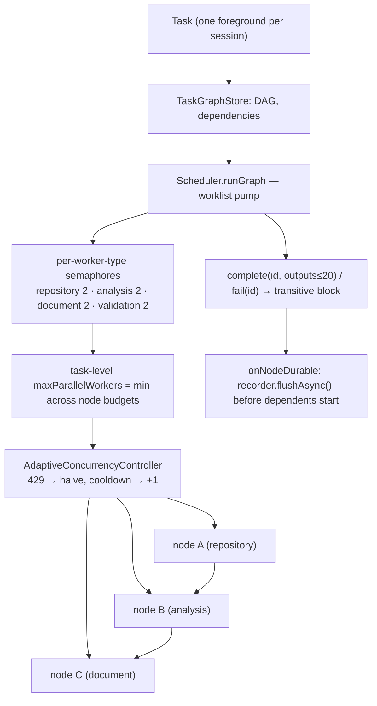

- **Sequential tasks:** enforced — one foreground task per session; a second `start` while running fails visibly ("Another task is still running…", `AgentRuntime.ts:293-299`). `MAX_TASKS = 20` prunes oldest terminal handles (`:441-455`).
- **Parallel tasks (nodes):** yes, dependency-driven — the worklist pump starts every `readyNodes()` node within per-type limits; `finally` re-pumps after each settle (`Scheduler.ts:59-93`).
- **Task dependencies:** explicit edges; `readyNodes` requires all dependencies `completed` (`contracts/TaskGraph.ts:104-110`); completed outputs (≤20 strings) are injected into dependent workers as "Prior analysis results (use these, do not re-derive them)" (`AnalysisWorker.ts:117-119`).
- **Sub-agents:** none — typed workers in one thread (see §5, §7).
- **Concurrent tool calls:** within a single pass, multiple tool calls execute sequentially in the loop (`for (const call of passResult.toolCalls)`, `toolLoopTaskRunner.ts:373-413`); parallelism exists only across nodes.
- **Concurrency limits:** 2 per worker type (`Scheduler.ts:31-36`), task-level min-cap, document parallelism `parallelDocuments ? 2 : 1` at wiring (`worker.ts:391`).
- **Scheduling:** worklist/DAG-based, not time-based; no cron, no preemption.
- **Result aggregation:** synthesis receives all node outputs plus a deterministic validation summary (`OrchestratorRunner.ts:467-487`, `formatValidationSummary():536-562`).
- **Consistency/validation passes:** per-document validation nodes + a cross-document node (only when >1 document, `Planner.ts:286-288`); cross-document contradictions resolved deterministically against the fact base first (`ValidationWorker.ts:522-541`).

---

## 13. Prompt Architecture

```mermaid
flowchart TD
    SYS["System prompts (static strings in code)"]
    S1["DEFAULT_SYSTEM — 'read-only repository analysis assistant…'<br/>toolLoopTaskRunner.ts:14-17"]
    S2["roleSystemPrompt — AnalysisWorker.ts:86-104"]
    S3["explorerSystemPrompt — RepositoryExplorerWorker.ts:49-67"]
    S4["synthesis system prompt — worker.ts:308-312"]
    S5["Planner system prompt — Planner.ts:210"]
    S6["DocumentWorker outline/section/fix prompts — DocumentWorker.ts:399,458,598,720"]
    S7["ValidationWorker judge/compare prompts — ValidationWorker.ts:350-363,502-509"]
    DYN["Dynamically assembled per call (ContextualModelProvider)"]
    D1["objective = last user message"]
    D2["task/node state bullets"]
    D3["facts ≤30 · findings ≤40 · evidence ≤20 excerpts"]
    D4["conversation ≤6 turns + prior session summary"]
    D5["instructions: project instructions + 'User request: …'"]
    TOOLS["Tool definitions (JSON schemas, filtered by feature flags)"]
    RESULTS["Tool results as role:'tool' messages"]
    CONV["Conversation history"]
    OUT["Output format enforcement"]
    O1["response_format: json_object (document + planner passes)"]
    O2["fenced JSON block templates in prompts"]
    O3["zod schema validation post-hoc + one repair retry"]

    SYS --> DYN
    DYN --> LLM["LLM call"]
    TOOLS --> LLM
    RESULTS --> LLM
    CONV --> LLM
    LLM --> OUT
```

**Which prompts control what:**

| Concern | Controlling prompt(s) | Static/dynamic |
|---|---|---|
| Agent identity + grounding | `DEFAULT_SYSTEM` — "Answer accurately and distinguish repository facts from recommendations. Use the provided tools to ground claims in the actual repository." (`toolLoopTaskRunner.ts:14-17`) | Static |
| Planning | "You design a bounded read-only repository-analysis plan. Return only one JSON object. Do not call tools." + JSON-shape user prompt (`Planner.ts:210,492-494`) | Static template + dynamic `Request: ${text}` |
| Tool usage | No dedicated prompt — tool schemas + the default system prompt; per-node narrowing via `allowedTools`; worker prompts command citation: "Every observed finding MUST cite only the exact evidence ids that support it." (`AnalysisWorker.ts:99-102`) | Static + dynamic |
| Code/repo analysis | `roleSystemPrompt` with `Objective:`, questions, and the observed/inferred/proposed taxonomy (`AnalysisWorker.ts:86-104`); explorer variant (`RepositoryExplorerWorker.ts:49-67`) | Dynamic (objective/questions) |
| Document generation | Outline prompt (`DocumentWorker.ts:303-305`), section prompt (`:453-457`) — "Ground every factual statement in the established facts" + block-type vocabulary; regeneration prompt (`:593-597`); Markdown-repair prompt (`:719`) | Static template + dynamic facts/headings |
| Output format | JSON-shape templates inside prompts ("Respond with ONLY a JSON block: …") **plus** `response_format:'json_object'` for document/planner passes, plus zod post-validation | Static |
| Validation judging | Claim prompt ("Extract up to 15 IMPORTANT claims… judge whether the cited evidence supports it", `ValidationWorker.ts:350-363`), repair prompt (`:381-386`), cross-document compare prompt (`:502-509`) | Static template + dynamic sections/facts |
| Final answer | "Produce the final user-facing answer from completed structured analysis. Do not reveal worker reasoning, planning traces, or invented repository facts…" (`worker.ts:308-312`) + `Completed task results: ${JSON.stringify(work)}` (`:315`) | Static + dynamic results |
| Conversation continuation | `resolvePlanningObjective` builds "Continue the following conversation while preserving its requested deliverable:" with `PENDING DELIVERABLE` + last 6 turns (`OrchestratorRunner.ts:508-513`) | Dynamic |

**Where prompt engineering compensates for missing architectural mechanisms:**

1. **Grounding is prompt-enforced, then code-audited.** The model is *told* to cite only evidence IDs, but the real guarantee is deterministic: `AnalysisWorker.commit` rejects unknown IDs and downgrades uncited `observed` claims (`:204-222`). Prompt alone would not hold.
2. **No structured-output API reliance.** All worker outputs are fenced-JSON-in-text with a repair retry and deterministic fallbacks — the prompts carry the schema templates because the loop-level model call isn't JSON-mode constrained for workers.
3. **Bounded retrieval is prompt-free.** The model is never asked to "search until confident"; caps are enforced in code (iterations, tool calls, budget).
4. **No self-consistency/reflection loop.** Instead, a dedicated validation worker + regeneration pipeline with precise section targeting (`sectionHeading` in claim output) — deterministically routed, not model-decided.
5. **Hidden reasoning.** `thinking:'disabled'` plus "Never chain-of-thought" gating replaces any need for prompt suppression of CoT in the UI.

---

## 14. Complete End-to-End Architecture

One large diagram of the actual implementation (deterministic = **(D)**, LLM = **(LLM)**):

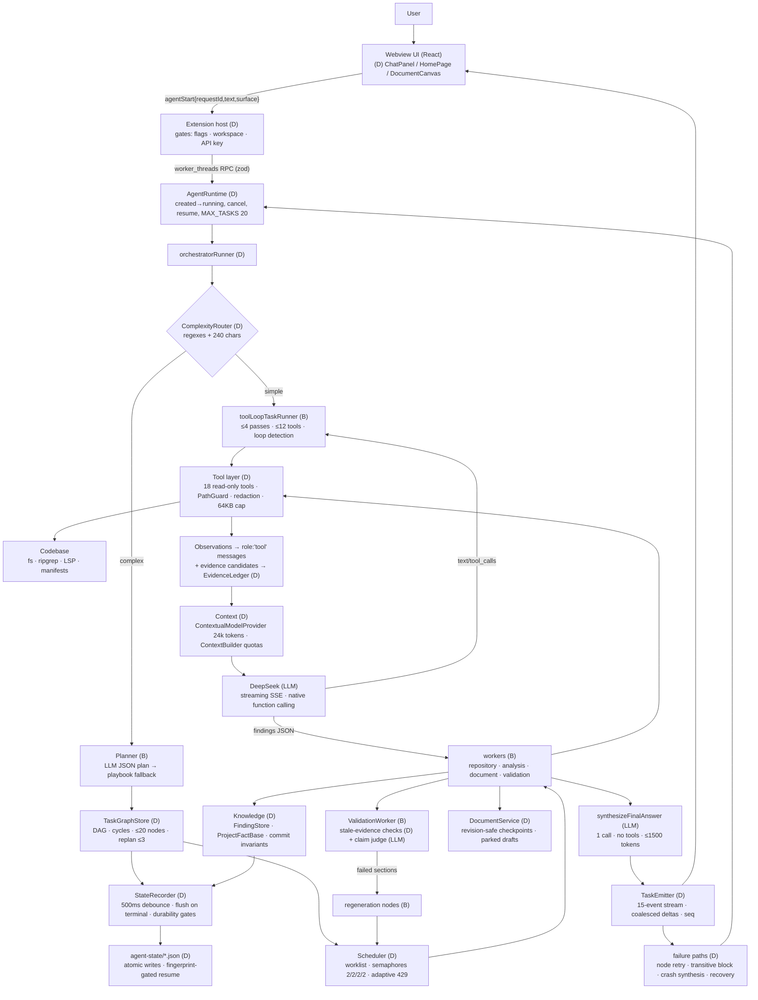

---

## 15. Mermaid User Flows

### 15.1 New coding task → analysis answer

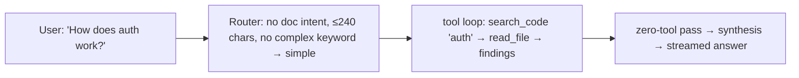

### 15.2 Codebase analysis (complex)

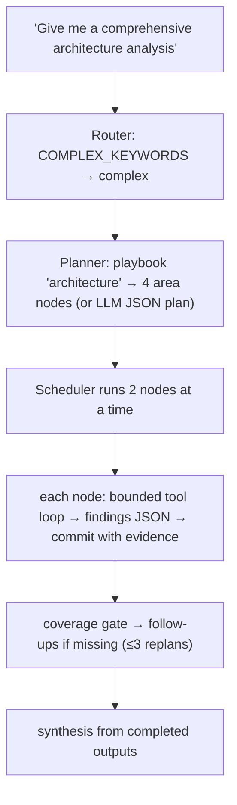

### 15.3 Code modification

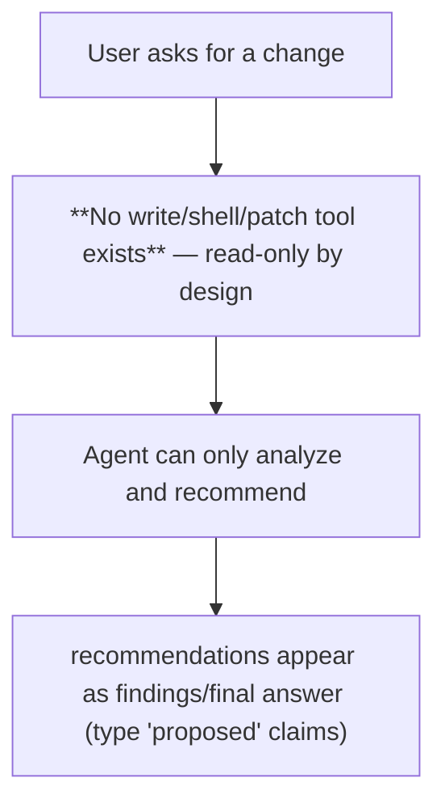

### 15.4 Document generation (the product's 'modification' path)

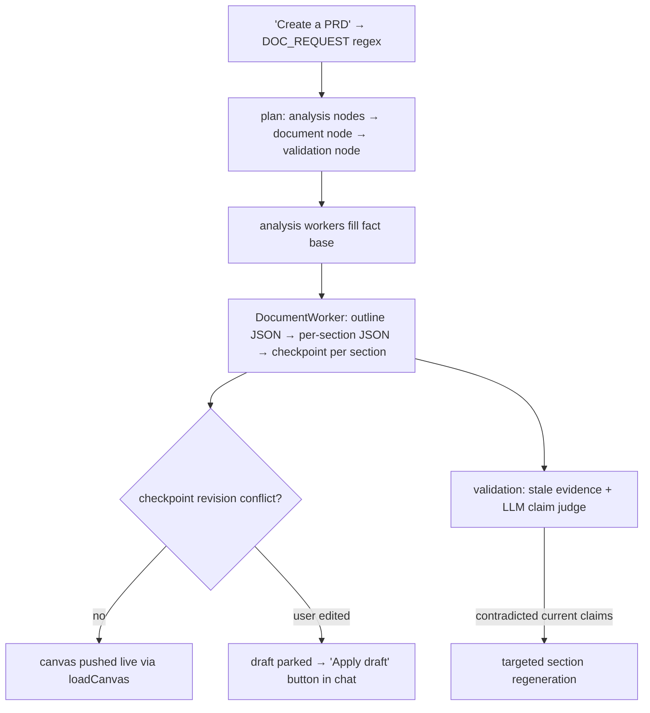

### 15.5 Debugging / investigation flow

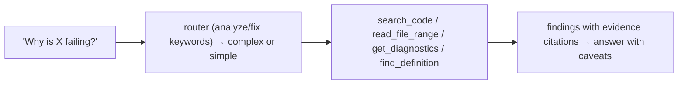

### 15.6 Test execution

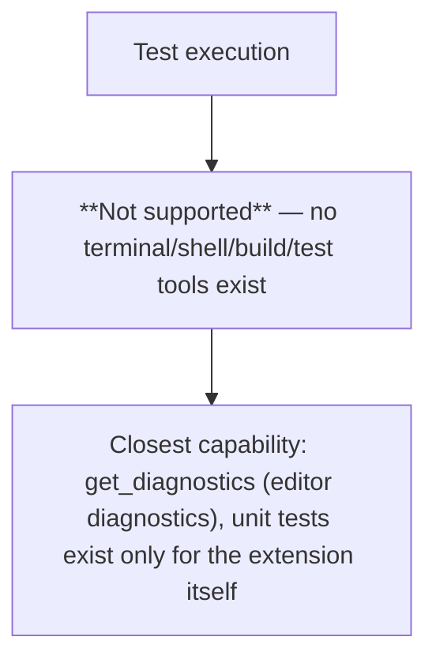

### 15.7 Failed tool call

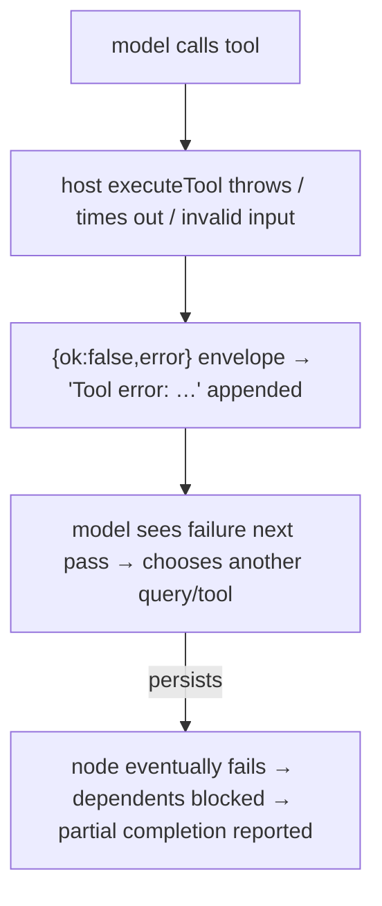

### 15.8 Failed task / recovery

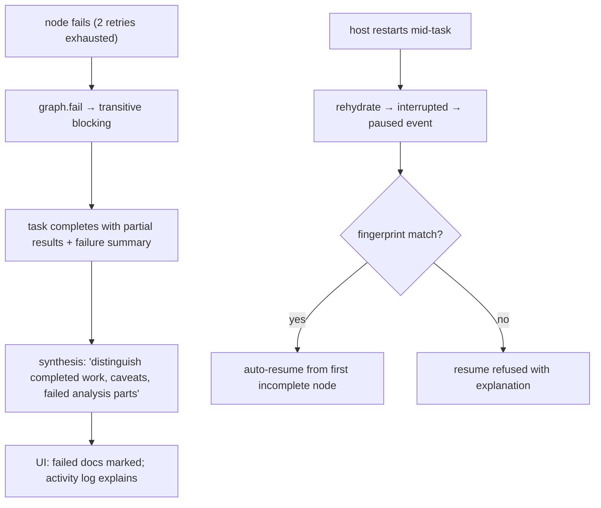

### 15.9 Multi-task (parallel node) execution

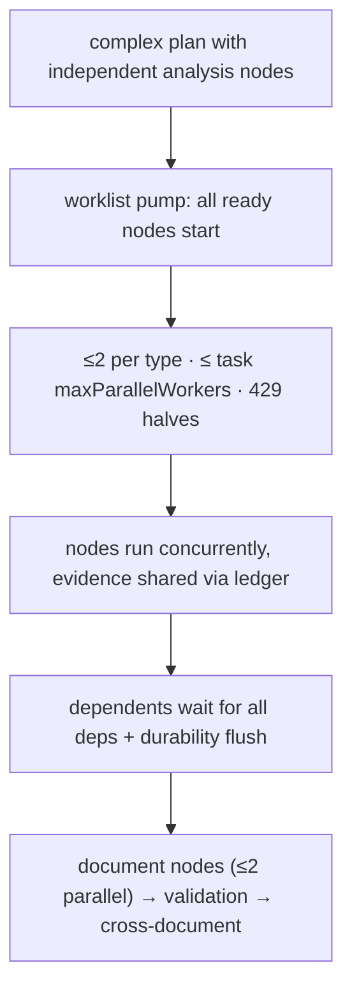

### 15.10 Sub-agent (worker) execution

```mermaid
flowchart TD
    A["node dispatched by workerType"] --> B["repository → RepositoryExplorerWorker"]
    A --> C["analysis → AnalysisWorker"]
    A --> D["document → DocumentWorker (no tools)"]
    A --> E["validation → ValidationWorker (hybrid)"]
    B --> F["all share: one provider, one knowledge layer, one event stream"]
    F --> G["outputs: WorkerRunResult + findings + replan signals"]
    G --> H["scheduler records complete/fail → pump again"]
```

### 15.11 Final response

```mermaid
flowchart TD
    A["all nodes settle (completed/failed/blocked)"] --> B["deterministic validation summary formatting"]
    B --> C["synthesizeFinalAnswer: 1 call, tools [], ≤1500 tokens"]
    C --> D["TaskEmitter.taskCompleted(summary)"]
    D --> E["webview: seq-checked event → bubble + plan status"]
```

---

## 16. Architecture Verdict

1. **Is the agent keyword/rule-driven or LLM-reasoning-driven?** LLM-reasoning-driven for content and tool use; rule-driven for routing, budgets, grounding, scheduling, and termination. Verdict: **primarily LLM-driven inside a deterministic shell** (§4).
2. **Where does deterministic logic control behavior?** `ComplexityRouter` (path selection); `Planner` fallback + playbooks (plan shape); `TaskGraphStore` (DAG integrity, replan budget, transitive failure); `Scheduler` (ordering, concurrency); `TaskBudgetController` (call/tool/token caps); retry/backoff and loop detection; `EvidenceLedger`/`FindingStore`/`ProjectFactBase` (grounding, dedupe, conflict arbitration); `ValidationWorker` staleness/coverage checks; `DocumentService` (revision safety); `FeatureFlags` (fail-closed capability cascade); `StateRecorder`/`PersistedState` (durability, fingerprint-gated resume).
3. **Where does the LLM control behavior?** Tool selection and arguments (native function calling); what to read; findings/unknowns/contradictions; follow-up and missing-coverage signals; optional structured plan; document outline and content; claim verdicts; cross-document contradiction detection; final answer prose.
4. **Is it actually a ReAct agent?** Yes for the per-node loop, *bounded*: reasoning pass → tool calls → observations → repeat, with caps, loop detection, and forced synthesis (`toolLoopTaskRunner.ts:334-441`). Not unbounded autonomous ReAct.
5. **Is it actually a Planner/Executor agent?** Yes for complex tasks — a structured, dependency-aware plan executed by a scheduler with per-node LLM work. Caveat: the default planner is deterministic (keyword playbooks); the LLM planner is optional and fallible by design.
6. **Is it a Deep Agent?** No — no self-directed planning beyond a small replan budget, no code writing, no sub-agent spawning, no long-horizon goal autonomy.
7. **Is it single-agent or multi-agent?** Single agent with four typed worker *roles* executed in one thread. No agent-to-agent communication; dependencies carry plain string outputs. The `subagents` flag names a mechanism that is not multi-agent in any architectural sense.
8. **Does it use hierarchical orchestration?** No — one deterministic orchestrator over one flat worker pool (plus a deterministic validation/regeneration stage). No supervisor LLM.
9. **Does it dynamically plan or follow predefined workflows?** Predefined workflow *shapes* (playbook coverage areas, fixed analysis→document→validation→cross-document pipeline) with bounded dynamic extension (replan ≤3, stall-terminated). The LLM fills content, it does not design the workflow.
10. **How autonomous is it?** Low-to-medium by design: it autonomously chooses tools and content within hard code limits, but cannot write files, run commands, use git, spawn agents, change its own plan structure, or exceed its budgets; document output parks on any user conflict.
11. **How does it handle large codebases?** Deterministically bounded retrieval: 100k-entry metadata index + ripgrep + LSP, model-driven narrowing, hard size caps (32KB files, 400-line ranges, 48KB searches, 64KB results), quota-truncated 24k-token context, evidence dedupe. No embeddings, no AST, no content index, no real LLM summaries.
12. **What is the biggest architectural bottleneck?** Single foreground task per session combined with the bounded tool loop's small iteration budget, and retrieval that is entirely lexical (no semantic search) — large-repo questions can exhaust the loop before finding the relevant file. A close second: `chars/4` token estimation makes context quotas approximate.
13. **What is the biggest architectural strength?** The evidence-grounding chain: every observed claim must cite evidence the model actually read (enforced by commit-time downgrades), evidence staleness is checked at validation and refreshed rather than deleted, diagnostics are structurally incapable of leaking content, and all state changes are atomic, durable, and fingerprint-gated. This is genuine grounding infrastructure, not prompt vibes.
14. **What parts are genuinely agentic vs conventional workflow code?** Genuinely agentic: native function-calling tool loops, LLM-driven retrieval, worker reasoning, LLM-as-judge validation, dynamic follow-up generation. Conventional workflow code: router, scheduler, graph store, budgets, retries, persistence, document revisioning, rollout gates, event streaming — none of which need an LLM.

```text
Agent Type:            Hybrid — bounded ReAct tool loop + Planner/Executor DAG pipeline + LLM-as-judge validation
Reasoning Model:       DeepSeek (deepseek-v4-pro via OpenAI-compatible API); thinking mode disabled
Planning Model:        Deterministic playbook/coverage planner with optional temperature-0 JSON LLM plan (fallback always)
Execution Model:       Dependency DAG → worklist scheduler → typed workers (repository/analysis/document/validation) → coverage gates → regeneration → synthesis
Tool Selection:        LLM (native function calling), tool set narrowed deterministically per node and by feature flags
Codebase Retrieval:    Lexical: fast-glob metadata index + ripgrep + LSP + manifest/dependency parsing; no embeddings/AST/content index
Memory:                Durable per-workspace JSON (tasks+graph+outputs, evidence, findings/facts, document IRs, session); fingerprint-gated resume; in-memory knowledge stores snapshotted
Concurrency:           Parallel nodes with per-type semaphores (2/2/2/2), adaptive 429 backpressure, one foreground task per session
Recovery:              Bounded retries (2 stream / 2 node), context-overflow rebuild, transitive DAG blocking, parked drafts, crash rehydration, fingerprint-refused resume
Autonomy Level:        Low-to-medium — autonomous tool use and content within hard code limits; read-only; no terminal/git/writes
Overall Architecture:  Deterministic-orchestrated, evidence-grounded, read-only repository-analysis agent (webview → extension host → worker thread)
```

---

## 17. Evidence / File References

**Runtime & orchestration**
- `extension/extension.ts` — host entry: webview panel, IPC router, AgentRuntimeClient wiring, host-side tool/document/state handlers, provider config, rollout fail-closed (`:100-110,147-211`).
- `extension/agent/AgentRuntimeClient.ts` — worker owner; RPC validation; `toolCancel` aborts; crash synthesis; `classifyFailure` (`:142-328`).
- `extension/agent-worker/worker.ts` — worker entry: provider creation, RPC executors, SessionStore, knowledge wiring, orchestrator options, `synthesizeFinalAnswer` (`:251-473`), restart recovery (`:511-530`).
- `extension/agent/runtime/AgentRuntime.ts` — task lifecycle, TaskEmitter, single-foreground-task guard, cancel/resume/prune (`:245-456`).
- `extension/agent/runtime/OrchestratorRunner.ts` — the orchestrator: routing, planning, execute closure with retry/coverage/replan gates, scheduler invocation, synthesis (`:194-492`), continuation objective (`:496-515`).
- `extension/agent/runtime/StreamCoalescer.ts` — 40ms/400-char delta batching.
- `extension/agent/runtime/workerProtocol.ts` — zod RPC schemas, diagnostic field caps.
- `shared/agentProtocol.ts` — 15-event protocol, seq/timestamp invariants, snapshot shape.

**Model & loop**
- `extension/agent/model/toolLoopTaskRunner.ts` — bounded tool loop, stream retries, budgets, loop detection, evidence handle context, `DEFAULT_SYSTEM` (`:14-17`), defaults (`:452-485`).
- `extension/agent/model/OpenAICompatibleProvider.ts` — raw fetch + SSE, thinking replay, error mapping, 120s timeout.
- `extension/agent/model/ProviderError.ts` — error taxonomy + retryable set + friendly messages.
- `extension/agent/model/jsonBlock.ts` — fenced/brace JSON extraction.
- `extension/agent/context/ContextBuilder.ts` — quota layer assembly, `[truncated]` marker.
- `extension/agent/context/ContextualModelProvider.ts` — 24k budget, per-call slices, context-field stripping.
- `extension/agent/config/Providers.ts`, `ProviderConfig.ts`, `ProviderValidation.ts` — DeepSeek-only catalogue, key validation.

**Planning & workers**
- `extension/agent/planner/ComplexityRouter.ts` — routing regexes + threshold.
- `extension/agent/planner/DocumentIntent.ts` — document-intent regex.
- `extension/agent/planner/playbooks.ts` — 5 keyword playbooks.
- `extension/agent/planner/Planner.ts` — deterministic planner, optional LLM plan, document/validation/cross-doc node builders, follow-ups/regenerations, node budgets (`:20-38`).
- `extension/agent/planner/TaskGraphStore.ts` — DAG store, replan budget, transitive blocking.
- `extension/agent/contracts/TaskGraph.ts` — node schema, cycle detection, readyNodes.
- `extension/agent/workers/Scheduler.ts` — worklist pump + semaphores.
- `extension/agent/workers/AnalysisWorker.ts`, `RepositoryExplorerWorker.ts` — evidence-grounded finding workers.
- `extension/agent/workers/DocumentWorker.ts` — outline/section generation, retries, checkpointing, regeneration.
- `extension/agent/workers/ValidationWorker.ts` — deterministic staleness/coverage + LLM claim judge + cross-document check.
- `extension/agent/workers/DocumentGateway.ts` — worker↔host document RPC.

**Repository layer**
- `extension/repository/RepositoryService.ts`, `RepositoryToolGateway.ts` — tool registry, gateway enforcement (zod, PathGuard, redaction, 64KB, 30s).
- `extension/repository/tools.ts`, `lspTools.ts`, `dependencyTools.ts` — tool implementations.
- `extension/repository/RipgrepSearch.ts`, `FileCatalog.ts`, `IncrementalFileCatalog.ts`, `RepositoryIndex.ts`, `ProjectDiscovery.ts`, `ProgressiveNarrowing.ts`, `SummaryService.ts`, `FileReader.ts`, `OutputLimiter.ts`, `IgnorePolicy.ts`, `SensitiveFilePolicy.ts`, `PathGuard.ts`, `PackageInspector.ts`, `DependencyAdapters.ts`, `LspBridge.ts`, `VscodeFileWatcher.ts`, `WorkspaceDescriptor.ts`.
- `extension/agent/contracts/ToolDefinition.ts` — 20-name contract (18 implemented; `get_git_diff`/`get_git_history`/`get_index_status` unimplemented; `get_document_symbols` implemented but absent from the union).

**State, knowledge, rollout, observability**
- `extension/agent/state/PersistedState.ts` — durable schema, atomic writes, fingerprints, caps.
- `extension/agent/state/StateRecorder.ts` — event mirroring, debounce, resume payloads.
- `extension/agent/knowledge/EvidenceLedger.ts`, `FindingStore.ts`, `ProjectFactBase.ts`, `KnowledgeCommitService.ts` — grounding invariants.
- `extension/agent/session.ts` — turn storage and compaction.
- `extension/agent/rollout/FeatureFlags.ts`, `GateEvaluator.ts` — flag cascade, gate ladder.
- `extension/agent/observability/OperationalLogger.ts`, `TaskControls.ts` — content-free diagnostics, budget/adaptive controllers.
- `extension/agent/eval/metrics.ts`, `eval/fixtures.ts` — deterministic eval metrics (execution harness "NOT executed yet", `fixtures.ts:1-6`).

**Documents & webview**
- `extension/documents/DocumentService.ts` — revision model, parked drafts, atomic writes.
- `extension/documents/DocumentIR.ts`, `DocumentRenderer.ts` — IR contract and rendering.
- `src/hooks/useAgentSession.ts` — 15-event reducer, seq/gap handling, snapshot reconciliation.
- `src/hooks/usePhaseDocument.ts` — revision-guarded editor saves, conflict flow.
- `src/components/chat/ChatPanel.tsx`, `ChatMarkdown.tsx` — chat UI, safe markdown.
- `src/components/canvas/*` — BlockNote canvas, 6 custom blocks, sanitization, Mermaid rendering.
- `src/utils/vscodeApi.ts`, `workspaceScope.ts`, `exportMarkdown.ts`, `mermaidSanitize.ts`, `profile.ts`.
- `src/components/settings/ProviderSettings.tsx`, `src/hooks/useProviders.ts` — key UI (key value never in webview).

---

## 18. Recommended Architectural Improvements

Each recommendation is grounded in a specific gap found in the code; none is speculative.

1. **Real tokenizer instead of `chars/4`.** `ContextBuilder.estimateTokens:34-37` approximates tokens as chars/4; `TaskBudgetController` reserves output before the call. A tiktoken-class tokenizer (or DeepSeek token counts from `stream_options.include_usage`) would make the 24k context budget and budget reservations accurate.
2. **Semantic retrieval.** `semanticRetrieval: false` ("remains future work", `FeatureFlags.ts:38-48`) with purely lexical ripgrep/glob search is the biggest coverage gap for large repos. An embeddings index over file/symbol chunks, exposed as one more read-only tool, would fit the existing gateway cleanly.
3. **Wire real LLM summaries.** `SummaryService` supports an injected provider but production passes `NoOpSummaryProvider` (`extension.ts:256-268`). Content-hash-cached LLM file summaries would give the ContextualModelProvider something better than a 200-char stub.
4. **Implement or delete the ghost tool names.** `get_git_diff`, `get_git_history`, `get_index_status` are declared in the contract with no implementation (`ToolDefinition.ts:8-28`) — they cannot be called, but their presence is misleading; `get_document_symbols` exists in `lspTools.ts:213` yet is missing from the union. Align contract with implementation (and add `get_document_symbols`/`get_diagnostics`/`get_call_hierarchy`/`get_repository_capabilities` to the LSP feature-flag filter for consistency, `FeatureFlags.ts:93-99`).
5. **Lift the one-foreground-task limit.** `AgentRuntime.start` rejects a second running task (`:293-299`) while the scheduler already supports per-type concurrency. Queuing (rather than rejecting) concurrent user asks would remove a user-visible serialization bottleneck; per-task budgets already bound cost.
6. **Higher tool-loop iteration ceilings for large-repo questions.** `maxIterations: 4` / `maxToolCalls: 12` defaults (`toolLoopTaskRunner.ts:273-275`) are tight for discovery-heavy asks; a per-node budget knob (the schema exists — `ToolLoopConfig:37-49`) rather than a global raise would target the complex path only.
7. **True tool-level retry.** Tool failures are surfaced to the model but never retried (`toolLoopTaskRunner.ts:405`); a single deterministic retry for idempotent read tools (searches/reads) with backoff would absorb transient fs/LSP flakiness.
8. **Parallel tool calls within a pass.** Tool calls execute sequentially (`:373-413`); since all tools are read-only, batch execution with `Promise.all` (under the tool budget) would cut multi-read passes' latency.
9. **Remove the plan loop's hidden counter.** The zero-coverage/coverage-stall logic in `OrchestratorRunner.ts:328-407` is subtle (a failed node "never closes its round" per the code comment); making coverage accounting per-node explicit rather than round-based would make the termination conditions provable.
10. **Fix stale comments that lag the implementation.** `worker.ts:255-256`, `FindingStore.ts:15`, `ProjectFactBase.ts:15` still claim "In-memory only … durability lands with Phase 14" although knowledge is already snapshotted into durable state — these mislead future readers about what survives a restart.
11. **Session summary is a compaction slot, not an LLM summary.** `session.ts` promotes objectives/IDs into `memory` deterministically; an occasional LLM-generated rolling summary (bounded, content-hash-cached) would improve multi-turn continuation quality (`resolvePlanningObjective` currently replays raw turns).
12. **Expose the dormant router classifier only when actually needed.** `ComplexityRouter.classify` (`:11-12,40`) is a complete hook but unused — fine to keep, but its existence should not imply the routing is model-based today.

---

*End of report. All claims above are citable to the paths listed in §17; line numbers reflect the tree at the time of writing.*